

  

<h1 align="center">Factory UI Gallery</h1>

Selected screens from the factory firmware show the interfaces available on each supported device. Click any image to view it at its original resolution.

## T-Deck

[T-Deck Quick Start](./lilygo-t-deck.md)

<table>
  <tr>
    <th width="50%">Launcher</th>
    <th width="50%">GNSS</th>
  </tr>
  <tr>
    <td><a href="../.github/assets/factory-ui/tdeck/launcher.png">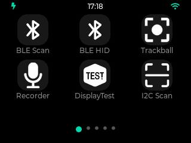</a></td>
    <td><a href="../.github/assets/factory-ui/tdeck/gnss.png">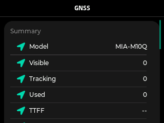</a></td>
  </tr>
  <tr>
    <th>LoRa Hub</th>
    <th>Keyboard</th>
  </tr>
  <tr>
    <td><a href="../.github/assets/factory-ui/tdeck/lora-hub.png">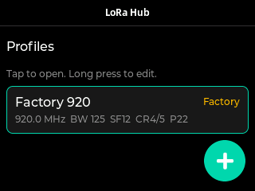</a></td>
    <td><a href="../.github/assets/factory-ui/tdeck/keyboard.png">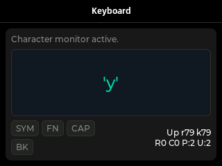</a></td>
  </tr>
</table>

## T-LoRa Pager

[T-LoRa Pager Quick Start](./lilygo-t-lora-pager.md)

<table>
  <tr>
    <th width="50%">Launcher</th>
    <th width="50%">Power</th>
  </tr>
  <tr>
    <td><a href="../.github/assets/factory-ui/tlora-pager/launcher.png">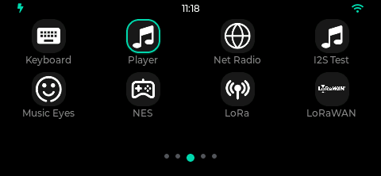</a></td>
    <td><a href="../.github/assets/factory-ui/tlora-pager/power.png">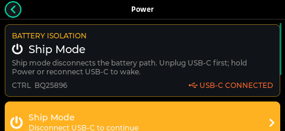</a></td>
  </tr>
  <tr>
    <th>Power Monitor</th>
    <th>GNSS</th>
  </tr>
  <tr>
    <td><a href="../.github/assets/factory-ui/tlora-pager/power-monitor.png">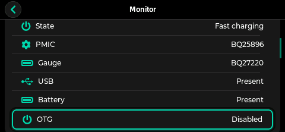</a></td>
    <td><a href="../.github/assets/factory-ui/tlora-pager/gnss.png">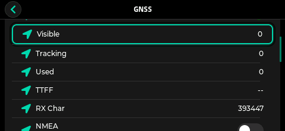</a></td>
  </tr>
</table>

## T-Watch S3

[T-Watch S3 Quick Start](./lilygo-t-watch-s3.md)

<table>
  <tr>
    <th width="50%">LoRa Hub</th>
    <th width="50%">Microphone</th>
  </tr>
  <tr>
    <td><a href="../.github/assets/factory-ui/twatch-s3/lora-hub.png">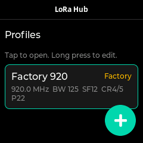</a></td>
    <td><a href="../.github/assets/factory-ui/twatch-s3/microphone.png">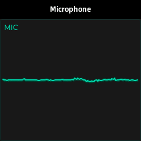</a></td>
  </tr>
  <tr>
    <th>Wi-Fi</th>
    <th>Device Status</th>
  </tr>
  <tr>
    <td><a href="../.github/assets/factory-ui/twatch-s3/wifi.png">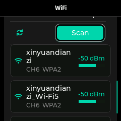</a></td>
    <td><a href="../.github/assets/factory-ui/twatch-s3/device-status.png">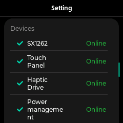</a></td>
  </tr>
</table>

## T-Watch Ultra

[T-Watch Ultra Quick Start](./lilygo-t-watch-ultra.md)

<table>
  <tr>
    <th width="50%">Launcher</th>
    <th width="50%">Power Monitor</th>
  </tr>
  <tr>
    <td><a href="../.github/assets/factory-ui/twatch-ultra/launcher.png">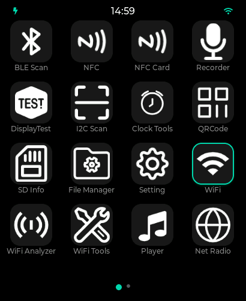</a></td>
    <td><a href="../.github/assets/factory-ui/twatch-ultra/power-monitor.png">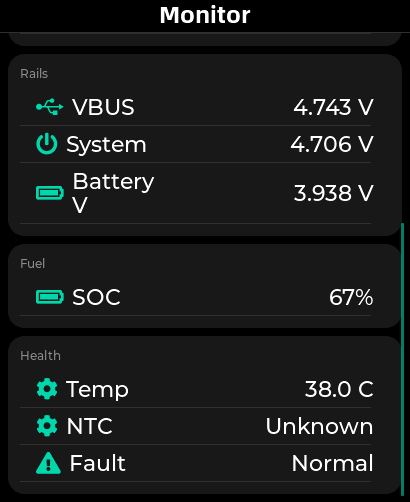</a></td>
  </tr>
  <tr>
    <th>LoRa Hub</th>
    <th>Wi-Fi</th>
  </tr>
  <tr>
    <td><a href="../.github/assets/factory-ui/twatch-ultra/lora-hub.png">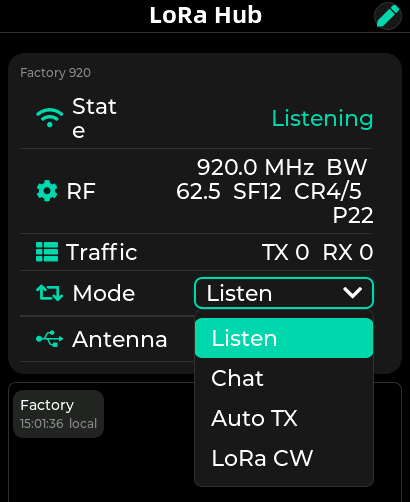</a></td>
    <td><a href="../.github/assets/factory-ui/twatch-ultra/wifi.png">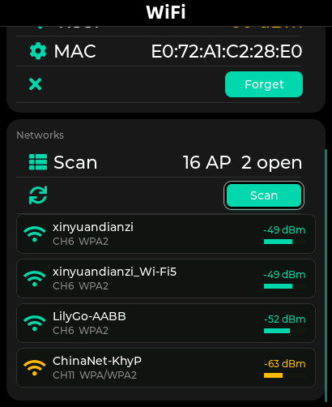</a></td>
  </tr>
</table>
