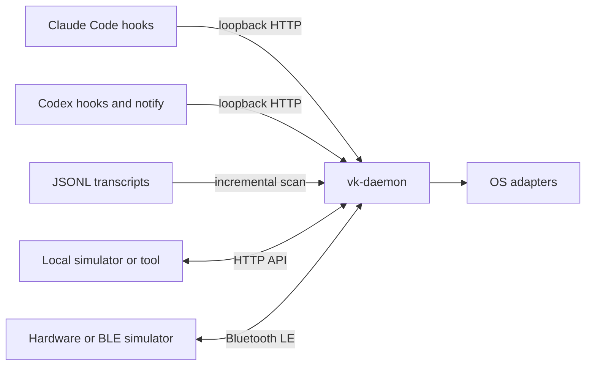

# Vibe Keyboard Daemon

[English](README.md) | [简体中文](README.zh-CN.md)

Vibe Keyboard is a Python 3.12+ daemon for controlling AI coding sessions. `vk-daemon`
collects Claude Code and Codex lifecycle events, maintains authoritative session and permission
state, and exposes that state to trusted local clients and Bluetooth LE peripherals.

This repository deliberately contains no bundled GUI, simulator, or firmware. A local client uses
the loopback HTTP API; hardware and BLE simulators implement the fixed peripheral protocol.

## What It Does

- Discovers Claude Code and Codex sessions from hooks, notifications, and JSONL transcripts.
- Tracks session lifecycle, active selection, notifications, pending permissions, and held keys.
- Resolves permission requests explicitly or with ordered YOLO allow/deny rules.
- Focuses terminal windows and invokes platform key, macro, notification, and sound adapters.
- Serves a stable local-simulator API on loopback HTTP.
- Acts as a BLE central and synchronizes state to a compatible hardware or simulator peripheral.
- Preserves the established little-endian BLE wire format and fixed GATT UUIDs.



## Requirements

- Python 3.12 or newer
- [`uv`](https://docs.astral.sh/uv/) for the documented development workflow
- Bluetooth and the `bleak` dependency for the default BLE mode
- macOS for the current focus, keystroke, notification, and local sound adapters

Runtime code otherwise uses the Python standard library.

## Platform Support

macOS is the primary and fully adapted platform. Linux supports the daemon's portable core but not
the desktop-control adapters. Windows is not yet an officially supported or project-verified host.

| Capability | macOS | Linux | Windows |
| --- | --- | --- | --- |
| Core daemon, loopback HTTP, configuration, and transcript scanning | Supported | Supported | Expected to run, but not project-verified |
| BLE central | Supported through CoreBluetooth | Supported through `bleak`/BlueZ | Expected through the `bleak` WinRT backend, but not project-verified |
| Claude Code and Codex hook installation and event delivery | Supported | Supported in a POSIX environment | Not officially supported; generated hook commands use POSIX shell quoting |
| Terminal-window focus | Supported for the implemented macOS terminal adapters | Not available | Not available |
| Keystrokes, macros, and Voice/Dictation | Supported; Voice/Dictation requires Accessibility and microphone permissions | Not available | Not available |
| Native notifications and bundled WAV playback | Supported through `osascript` and `afplay` | No-op | No-op |

Linux BLE requires a working BlueZ service, a compatible Bluetooth adapter, and sufficient user
permissions. The local sound limitation does not affect `PlaySound` messages sent to a connected
BLE peripheral; those sounds are handled by the device.

## Quick Start

Install with BLE support and start the daemon:

```bash
uv sync --extra ble
uv run vk-daemon serve
```

BLE is enabled by default. The daemon scans for compatible peripherals and keeps the loopback HTTP
API available for local integrations. To run without Bluetooth, explicitly start HTTP-only mode:

```bash
uv sync
uv run vk-daemon serve --no-ble
```

The default HTTP base URL is `http://127.0.0.1:19280`. The daemon refuses non-loopback bind
addresses. Do not expose it through a reverse proxy, tunnel, port forward, or LAN listener.

Install the AI tool integrations after the daemon environment is available:

```bash
uv run vk-daemon setup install claude-code
uv run vk-daemon setup install codex
uv run vk-daemon setup status
```

Confirm the daemon and inspect its state:

```bash
curl -sS http://127.0.0.1:19280/health
curl -sS http://127.0.0.1:19280/device/state
curl -sS http://127.0.0.1:19280/sessions
```

Send a simulated button click:

```bash
curl -sS \
  -H 'Content-Type: application/json' \
  -d '{"id":"send","action":"click"}' \
  http://127.0.0.1:19280/button
```

See the [HTTP API reference](docs/http_api.md) for request and response contracts.

## macOS Permissions

These permissions are managed by macOS Transparency, Consent, and Control (TCC). They are not Unix
root privileges: do not run `vk-daemon` with `sudo`. macOS attributes a command-line daemon's
permissions to the host application that launches it, so Terminal, iTerm2, and Visual Studio Code
have separate authorization states.

| Permission | System Settings location | Required for |
| --- | --- | --- |
| Bluetooth | Privacy & Security > Bluetooth | Scanning for and connecting to the VibeKeyboard peripheral |
| Accessibility | Privacy & Security > Accessibility | Window focus and synthesized keystrokes, including the double-Fn Dictation shortcut |
| Microphone | Privacy & Security > Microphone | Voice/Dictation audio input |

Before using the hardware Voice key, enable macOS Dictation and select **Press Fn Key Twice** under
**System Settings > Keyboard > Dictation > Shortcut**. `vk-daemon serve` requests microphone and
synthesized-event access at startup; macOS requests Bluetooth access when BLE scanning begins.
Always grant access to the application that is actually running the daemon. For example, enabling
Visual Studio Code does not authorize Terminal.

After a denial, macOS may not display the prompt again. Enable the host application manually in
the locations above, completely quit and reopen that application, and then restart the daemon.
Check the effective permissions from a second terminal belonging to the same host application:

```bash
uv run vk-daemon setup status
```

For Voice/Dictation, `system.accessibility` should be `true` and
`system.microphone_authorization` should be `authorized`. Daemon startup should also log:

```text
voice.microphone status=authorized
voice.accessibility status=authorized
```

If Voice works from Visual Studio Code but not Terminal, grant both Microphone and Accessibility
to Terminal, quit Terminal completely, reopen it, and start `vk-daemon` again. Detailed failures
are written to `~/.config/vk-daemon/daemon.log`.

## Configuration

The default configuration path is `~/.config/vk-daemon/config.toml`. Use `--config PATH` before
the subcommand to select another file. Missing or invalid configuration falls back to built-in
defaults; `config set` validates and atomically persists changes.

```bash
uv run vk-daemon config show
uv run vk-daemon config set yolo.active true
uv run vk-daemon config set ble.scan_timeout_seconds 10
uv run vk-daemon --config ./vk.toml serve --no-ble
```

Important defaults:

| Key | Default | Meaning |
| --- | --- | --- |
| `general.hook_port` | `19280` | Loopback HTTP port |
| `general.log_level` | `info` | Daemon log level |
| `ble.enabled` | `true` | Start BLE scanning and reconnect loop |
| `ble.scan_timeout_seconds` | `5` | Timeout for one scan attempt |
| `ble.reconnect_delay_seconds` | `2` | Delay before reconnecting |
| `macros.voice` | `dictation` | Toggle macOS Dictation with native double-Fn modifier events |
| `yolo.active` | `false` | Enable automatic permission decisions |
| `sound.volume` | `80` | Sound volume from 0 through 100 |

`config reset` writes defaults and preserves an existing file as `config.toml.bak`. Permission
requests wait for at most 300 seconds and fail closed on timeout or internal error.

For the hardware Voice key, hold Voice while speaking and release it to stop. See
[macOS Permissions](#macos-permissions) for the Dictation shortcut and host-application access
requirements.

## CLI Reference

```text
vk-daemon [--config PATH] serve [--host HOST] [--port PORT] [--no-ble]
                          [--ble-scan-timeout SECONDS]
vk-daemon [--daemon-port PORT] session list
vk-daemon [--daemon-port PORT] session status ID
vk-daemon [--daemon-port PORT] focus ID
vk-daemon config show | set KEY VALUE | reset
vk-daemon setup status
vk-daemon setup install|uninstall claude-code|codex [--port PORT]
vk-daemon [--daemon-port PORT] notify test
```

Run `uv run vk-daemon COMMAND --help` for command-specific details. `--daemon-port` applies to
commands that call a running daemon; `serve --port` changes the listener for that process.

## External Client Boundaries

A simulator running on the daemon computer should depend only on these stable routes:

| Method | Route | Use |
| --- | --- | --- |
| `GET` | `/device/state` | Read one authoritative snapshot |
| `GET` | `/sessions` | Read sessions only |
| `GET` | `/notifications` | Read notification history |
| `POST` | `/button` | Send a logical button action |
| `POST` | `/knob` | Send a rotary input |
| `POST` | `/permissions/{id}` | Resolve one pending request |

Hook, setup, configuration, sound, health, focus, and diagnostic routes are internal daemon
integrations, not part of the stable external-simulator contract.

A BLE simulator must act as a peripheral. It should advertise the `VibeKeyboard` name or fixed
service UUID, expose the command characteristic for daemon writes, and expose the event
characteristic for notifications to the daemon. UUIDs, tags, maximum message size, field order,
and reconnect synchronization are specified in the [BLE protocol](docs/ble_protocol.md).

## Development

```bash
uv sync --extra dev --extra ble
uv run pytest
uv run ruff check .
uv run mypy src
```

The package boundaries are:

```text
src/vibe_keyboard/
  core/       dependency-free domain types
  protocol/   BLE message models and binary codec
  transport/  async transport contracts and optional BLE central
  daemon/     HTTP server, state, hooks, setup, and platform adapters
```

See [architecture.md](architecture.md) for ownership and runtime flows,
[docs/migration.md](docs/migration.md) for migration from the previous multi-runtime design, and
[CONTRIBUTING.md](CONTRIBUTING.md) for contribution rules.

## Current Scope

- Claude Code supports lifecycle hooks. Codex sessions are discovered from local session files;
  `notify` reports completion and the `PermissionRequest` hook handles approvals.
- Cursor can be detected, but hook installation is not implemented.
- ESP32/SG2002 firmware lives in a separate project and shares only the BLE wire contract.
- HTTP is strictly local. A client on another host must move beside the daemon or implement a BLE
  peripheral.
- BLE has no application-level authentication. Only trusted peripherals should advertise the
  service near the daemon.

## License

MIT
