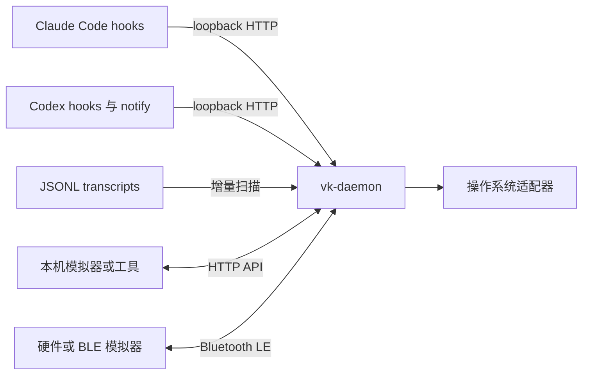

# Vibe Keyboard Daemon

[English](README.md) | [简体中文](README.zh-CN.md)

Vibe Keyboard 是一个基于 Python 3.12+ 的 AI 编码会话控制守护进程。`vk-daemon`
收集 Claude Code 和 Codex 的生命周期事件，维护权威的会话与权限状态，并将这些状态提供给
可信的本机客户端和 Bluetooth LE 外设。

本仓库有意不包含内置 GUI、模拟器或固件。本机客户端通过 loopback HTTP API 接入；硬件与
BLE 模拟器则实现固定的 peripheral 协议。

## 主要能力

- 从 hook、通知和 JSONL transcript 中发现 Claude Code 与 Codex 会话。
- 跟踪会话生命周期、当前选择、通知、待处理权限和按键保持状态。
- 通过显式操作或有序的 YOLO 允许/拒绝规则处理权限请求。
- 调用平台适配器聚焦终端窗口，并执行按键、宏、通知和声音操作。
- 通过 loopback HTTP 提供稳定的本机模拟器 API。
- 作为 BLE central，将状态同步到兼容的硬件或模拟器 peripheral。
- 保持既有的小端序 BLE wire format 和固定 GATT UUID 不变。



## 环境要求

- Python 3.12 或更高版本
- 文档中的开发流程使用 [`uv`](https://docs.astral.sh/uv/)
- 默认 BLE 模式需要 Bluetooth 和 `bleak` 依赖
- 当前窗口聚焦、按键、通知和本机声音适配器面向 macOS

除此之外，运行时代码只使用 Python 标准库。

## 平台支持

macOS 是主要且完整适配的平台。Linux 支持 daemon 的可移植核心，但不提供桌面控制适配器。
Windows 尚未作为正式支持的平台完成项目级验证。

| 能力 | macOS | Linux | Windows |
| --- | --- | --- | --- |
| 核心 daemon、loopback HTTP、配置和 transcript 扫描 | 支持 | 支持 | 预期可运行，但未经项目验证 |
| BLE central | 通过 CoreBluetooth 支持 | 通过 `bleak`/BlueZ 支持 | 预期可使用 `bleak` WinRT backend，但未经项目验证 |
| Claude Code/Codex hook 安装和事件上报 | 支持 | 在 POSIX 环境中支持 | 未正式支持；生成的 hook 命令使用 POSIX shell quoting |
| 终端窗口聚焦 | 支持已实现的 macOS 终端适配器 | 不可用 | 不可用 |
| 按键、宏和 Voice/听写 | 支持；Voice/听写需要辅助功能和麦克风权限 | 不可用 | 不可用 |
| 原生通知和内置 WAV 本机播放 | 通过 `osascript` 和 `afplay` 支持 | no-op | no-op |

Linux BLE 需要正常运行的 BlueZ 服务、兼容的 Bluetooth 适配器以及足够的用户权限。本机声音
限制不影响发送给已连接 BLE peripheral 的 `PlaySound` 消息；这类声音由设备端处理。

## 快速开始

安装 BLE 支持并启动 daemon：

```bash
uv sync --extra ble
uv run vk-daemon serve
```

BLE 默认启用。daemon 会扫描兼容的 peripheral，同时保留 loopback HTTP API 供本机集成使用。
如需在没有 Bluetooth 的环境中运行，请显式启动仅 HTTP 模式：

```bash
uv sync
uv run vk-daemon serve --no-ble
```

默认 HTTP 地址为 `http://127.0.0.1:19280`。daemon 会拒绝非 loopback 绑定。不要通过反向代理、
隧道、端口转发或局域网监听暴露该服务。

daemon 环境就绪后，安装 AI 工具集成：

```bash
uv run vk-daemon setup install claude-code
uv run vk-daemon setup install codex
uv run vk-daemon setup status
```

确认服务并查看当前状态：

```bash
curl -sS http://127.0.0.1:19280/health
curl -sS http://127.0.0.1:19280/device/state
curl -sS http://127.0.0.1:19280/sessions
```

模拟一次按钮点击：

```bash
curl -sS \
  -H 'Content-Type: application/json' \
  -d '{"id":"send","action":"click"}' \
  http://127.0.0.1:19280/button
```

完整请求与响应契约见 [HTTP API 中文文档](docs/http_api.zh-CN.md)。

## macOS 权限

这些权限由 macOS 的透明度、许可与控制（TCC）管理，并不是 Unix root 权限；不要使用 `sudo` 运行 `vk-daemon`。对于命令行 daemon，macOS 会把权限归属到启动它的宿主应用，因此 Terminal、iTerm2 和 Visual Studio Code 的授权状态彼此独立。

| 权限 | 系统设置位置 | 用途 |
| --- | --- | --- |
| 蓝牙 | 隐私与安全性 > 蓝牙 | 扫描并连接 VibeKeyboard BLE peripheral |
| 辅助功能 | 隐私与安全性 > 辅助功能 | 聚焦窗口和发送合成按键，包括用于听写的“双击 Fn” |
| 麦克风 | 隐私与安全性 > 麦克风 | Voice/听写的音频输入 |

使用硬件 Voice 键前，请启用 macOS 听写，并在 **系统设置 > 键盘 > 听写 > 快捷键** 中选择 **按下 Fn 键两次** 。`vk-daemon serve` 启动时会请求麦克风和合成按键权限，开始 BLE 扫描时 macOS 会请求蓝牙权限。应始终授权给实际运行 daemon 的宿主应用；例如，为 Visual Studio Code 开启权限并不会同时授权 Terminal。

如果此前已拒绝，macOS 可能不会再次显示弹窗。请在上述位置手动开启宿主应用的权限，完全退出并重新打开该应用，然后重启 daemon。在同一宿主应用的另一个终端中检查实际生效的权限：

```bash
uv run vk-daemon setup status
```

使用 Voice/听写时，`system.accessibility` 应为 `true`，
`system.microphone_authorization` 应为 `authorized`。daemon 启动日志还应同时出现：

```text
voice.microphone status=authorized
voice.accessibility status=authorized
```

如果 Voice 在 Visual Studio Code 中正常、在 Terminal 中失败，请同时为 Terminal 开启麦克风和辅助功能权限，完全退出并重新打开 Terminal，再启动 `vk-daemon`。详细错误记录在 `~/.config/vk-daemon/daemon.log`。

## 配置

默认配置路径为 `~/.config/vk-daemon/config.toml`。在子命令前使用 `--config PATH` 可选择其他
文件。配置缺失或无效时会回退到内置默认值；`config set` 会先校验，再原子写入。

```bash
uv run vk-daemon config show
uv run vk-daemon config set yolo.active true
uv run vk-daemon config set ble.scan_timeout_seconds 10
uv run vk-daemon --config ./vk.toml serve --no-ble
```

重要默认值：

| 配置项 | 默认值 | 含义 |
| --- | --- | --- |
| `general.hook_port` | `19280` | loopback HTTP 端口 |
| `general.log_level` | `info` | daemon 日志级别 |
| `ble.enabled` | `true` | 启动 BLE 扫描与重连循环 |
| `ble.scan_timeout_seconds` | `5` | 单次扫描超时 |
| `ble.reconnect_delay_seconds` | `2` | 重连前等待时间 |
| `macros.voice` | `dictation` | 通过原生“双击 Fn”修饰键事件切换 macOS 听写 |
| `yolo.active` | `false` | 启用自动权限决策 |
| `sound.volume` | `80` | 0 到 100 的声音音量 |

`config reset` 会写入默认值，并把已有文件保留为 `config.toml.bak`。权限请求最多等待 300 秒；
超时或内部错误时默认拒绝。

使用硬件 Voice 键时，按住 Voice 说话，释放后停止。听写快捷键和宿主应用权限要求见 [macOS 权限](#macos-权限)。

## CLI 参考

```text
vk-daemon [--config PATH] serve [--host HOST] [--port PORT] [--no-ble]
                          [--ble-scan-timeout SECONDS]
vk-daemon [--daemon-port PORT] session list
vk-daemon [--daemon-port PORT] session status ID
vk-daemon [--daemon-port PORT] focus ID
vk-daemon config show | set KEY VALUE | reset
vk-daemon setup status
vk-daemon setup install|uninstall claude-code|codex [--port PORT]
vk-daemon [--daemon-port PORT] notify test
```

使用 `uv run vk-daemon COMMAND --help` 查看命令细节。`--daemon-port` 用于连接正在运行的daemon；`serve --port` 则修改当前进程的监听端口。

## 外部客户端边界

与 daemon 同机运行的模拟器只应依赖以下稳定路由：

| 方法 | 路由 | 用途 |
| --- | --- | --- |
| `GET` | `/device/state` | 读取一次权威快照 |
| `GET` | `/sessions` | 只读取会话 |
| `GET` | `/notifications` | 读取通知历史 |
| `POST` | `/button` | 发送逻辑按钮操作 |
| `POST` | `/knob` | 发送旋钮操作 |
| `POST` | `/permissions/{id}` | 处理一个待决权限请求 |

Hook、setup、配置、声音、健康检查、聚焦和诊断路由属于 daemon 内部集成，不属于稳定的外部模拟器契约。

BLE 模拟器必须充当 peripheral。它应广播 `VibeKeyboard` 名称或固定 service UUID，提供接收 daemon 写入的 command characteristic，并通过 event characteristic 向 daemon 发送 notification。UUID、tag、最大消息长度、字段顺序和重连同步规则见 [BLE 协议中文文档](docs/ble_protocol.zh-CN.md)。

## 开发

```bash
uv sync --extra dev --extra ble
uv run pytest
uv run ruff check .
uv run mypy src
```

包边界如下：

```text
src/vibe_keyboard/
  core/       无项目依赖的领域类型
  protocol/   BLE 消息模型和二进制 codec
  transport/  异步 transport 契约和可选 BLE central
  daemon/     HTTP 服务、状态、hook、setup 和平台适配器
```

所有权和运行流程见 [架构中文文档](architecture.zh-CN.md)，从旧的多运行时设计迁移见 [迁移中文文档](docs/migration.zh-CN.md)，贡献规范见 [CONTRIBUTING.md](CONTRIBUTING.md)。

## 当前范围

- Claude Code 支持生命周期 hook。Codex 会话从本地 session 文件发现；`notify` 上报完成状态，
  `PermissionRequest` hook 处理审批。
- Cursor 可以被检测，但尚未实现 hook 安装。
- ESP32/SG2002 固件位于独立项目，只共享 BLE wire contract。
- HTTP 严格限于本机。其他主机上的客户端必须移动到 daemon 同机运行，或实现 BLE peripheral。
- BLE 没有应用层认证。daemon 附近只能由可信设备广播该 service。

## License

MIT
