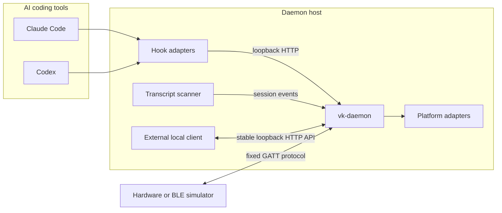
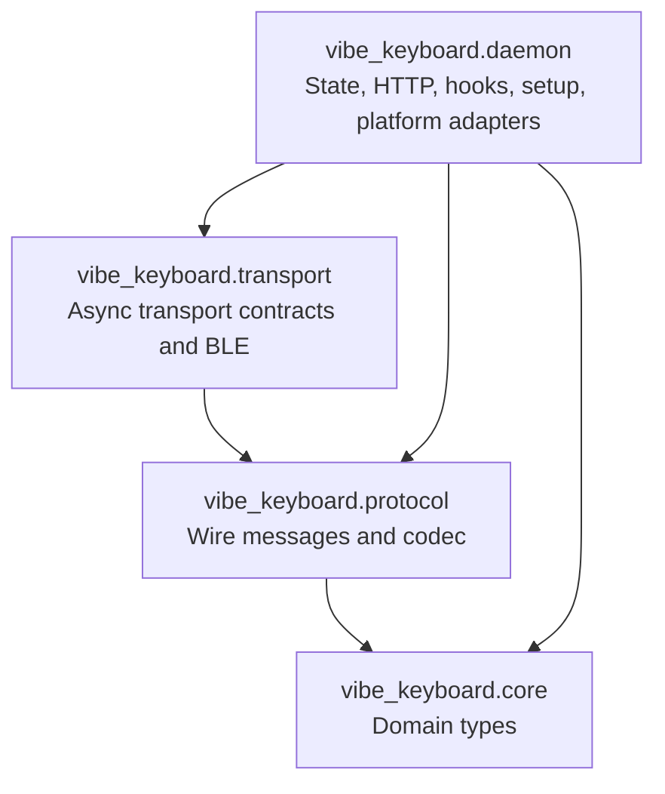
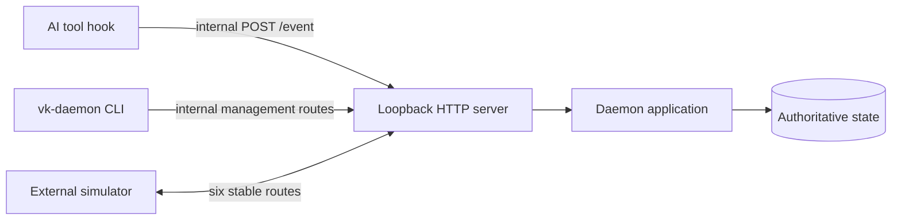
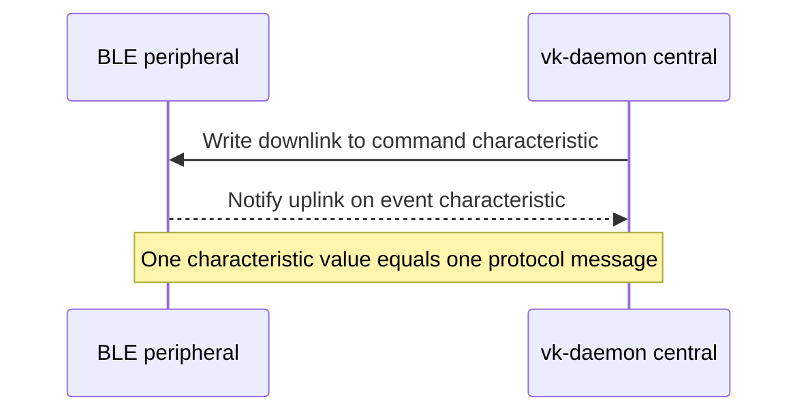
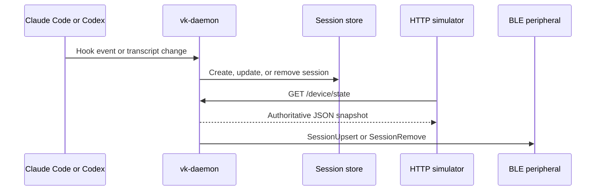
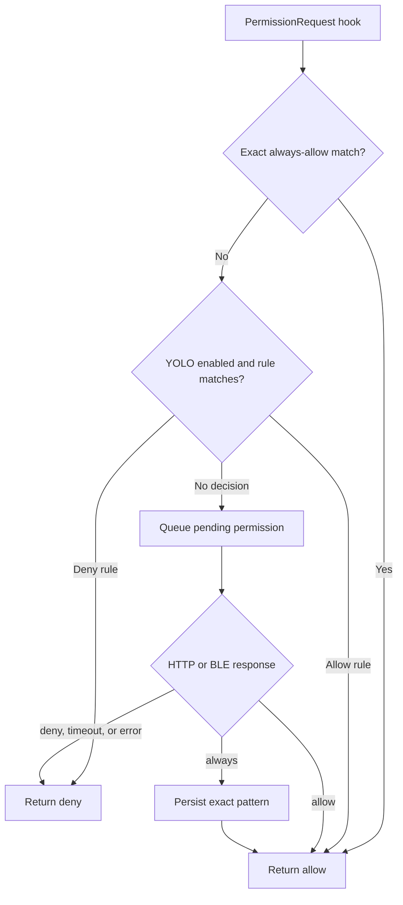

# Vibe Keyboard Architecture

[English](architecture.md) | [简体中文](architecture.zh-CN.md)

Vibe Keyboard is a daemon-only Python service. `vk-daemon` is the sole runtime process and the
authoritative owner of sessions, notifications, pending permissions, active-session selection,
held keys, and persisted configuration.

## System Context

The daemon owns state transitions. HTTP clients and BLE peripherals render snapshots and submit
intent; they do not become alternative state owners.

## Package Boundaries

| Package | Responsibility | Dependency rule |
| --- | --- | --- |
| `vibe_keyboard.core` | Session, notification, input, and status domain types | No project-layer dependencies |
| `vibe_keyboard.protocol` | BLE uplink/downlink records and binary codec | Depends on core types only |
| `vibe_keyboard.transport` | `asyncio` transport protocol and optional BLE central | Depends on protocol/core |
| `vibe_keyboard.daemon` | Authoritative state, HTTP, discovery, approvals, setup, and OS actions | Composes all lower layers |

Runtime dependencies remain in the standard library. `bleak` is isolated behind the optional
`ble` extra.

## Runtime Ownership

| State | Owner | Persistence | Consumers |
| --- | --- | --- | --- |
| Sessions and active session | Daemon memory | Rebuilt from hooks/transcripts | HTTP, BLE, focus adapter |
| Notifications | Daemon memory | Process lifetime | HTTP, BLE, OS notifier |
| Pending permissions | Daemon memory | Until decision or timeout | Hook waiter, HTTP, BLE |
| YOLO and always-allow rules | Daemon | TOML configuration | Permission evaluator, HTTP, BLE |
| Held injected keys | Daemon memory | Until matching release/process exit | HTTP diagnostics |
| BLE sync cache | One BLE connection | Cleared on disconnect | Incremental downlink sync |

Configuration defaults to `~/.config/vk-daemon/config.toml`. Writes are validated and replaced
atomically. Session and notification state intentionally does not survive a daemon restart.

## HTTP Boundary

The daemon listens on `127.0.0.1:19280` by default and rejects non-loopback bind addresses. HTTP
serves both internal AI-tool integrations and the stable surface for a simulator on the same host.

The stable simulator routes are `GET /device/state`, `GET /sessions`, `GET /notifications`,
`POST /button`, `POST /knob`, and `POST /permissions/{id}`. `GET /device/state` is the atomic
snapshot endpoint; clients should prefer it for initial load and regular reconciliation.

Browser requests with an `Origin` header are accepted only from loopback origins. This protects
against arbitrary websites calling a local daemon, but it is not remote authentication. See the
[HTTP API reference](docs/http_api.md) for the complete public JSON contract.

## BLE Boundary

The daemon is a BLE central. Hardware and BLE simulators are peripherals that advertise the fixed
service, accept command writes, and notify events.

There is no additional stream envelope, checksum, application authentication, or protocol-level
fragmentation. The command characteristic must support a complete logical write of up to 500
bytes. See the [BLE protocol](docs/ble_protocol.md) for UUIDs and exact layouts.

## Session Synchronization

Hook events and transcript discovery are normalized into domain events. The daemon commits each
change before it appears in HTTP snapshots or BLE updates.

On a new BLE connection, the daemon sends `TimeSync`, then starts a full session rebuild with
`SessionListClear` and one `SessionUpsert` per session. It follows with notifications, YOLO state,
and pending permissions. Later syncs use a per-connection cache to send changed/removed sessions;
reconnect clears the cache and forces another complete rebuild.

## Permission Flow

Permission handling is fail-closed. Exact persisted always-allow matches are evaluated first,
followed by YOLO deny/allow rules. If neither decides the request, it remains pending for an
explicit HTTP or BLE decision.

The HTTP response is `POST /permissions/{id}`; BLE uses uplink `PermissionResponse` (`0x06`).
`always` first persists the exact `tool_name(tool_input)` value and leaves the request pending if
that write fails. The default wait is 300 seconds.

## Input Flow

Button and knob events arrive through HTTP or BLE and share the same application handlers.
Permission actions take priority: while a permission is pending, Send approves and Cancel denies.
Otherwise inputs can change the active session, focus its terminal window, inject Enter/Escape,
toggle YOLO mode, invoke the configured Delete macro, or start and stop the configured Voice
action. The default macOS Voice action toggles system Dictation with the double-Fn shortcut.

OS adapters are best-effort platform boundaries. Failure to focus, inject input, persist required
state, or invoke another required action is reported to HTTP clients as `503` and logged.

## Concurrency and Shutdown

`asyncio` coordinates the HTTP server, transcript scanner, BLE reconnect loop, and permission
waiters. A shared application lock protects compound state reads and mutations. Blocking platform
and file operations run through worker threads where required.

On `SIGINT` or `SIGTERM`, the daemon cancels background tasks, clears/closes the current transport,
and closes the HTTP server. Outstanding permission paths fail closed through their cancellation or
timeout handling.

## Security and Failure Model

- HTTP binding is loopback-only; non-loopback browser origins are rejected.
- Invalid JSON, enum values, numeric ranges, unknown tags, and truncated BLE messages do not
  mutate daemon state.
- Permission timeout, cancellation, and internal failure resolve to deny.
- BLE disconnect clears connection state; reconnect performs authoritative synchronization.
- BLE disconnect and daemon shutdown release held input actions, including active Dictation.
- BLE discovery accepts the first nearby peripheral matching the device name or service UUID.
  Since the protocol has no identity or message authentication, only trusted peripherals may
  advertise it near the daemon.
- HTTP is not a cross-host control protocol. A remote client must use a trusted BLE peripheral or
  run locally with the daemon.

## Compatibility Rules

The BLE UUIDs, message tags, field order, integer widths, and little-endian encoding are public
compatibility boundaries. Change them only with an explicit protocol version and migration plan.
External firmware remains a separate project.

The stable HTTP simulator DTOs and six routes are also compatibility boundaries. Internal hook,
setup, sound, configuration, focus, health, and diagnostic routes may evolve with the daemon and
must not be used as an external simulator API.
