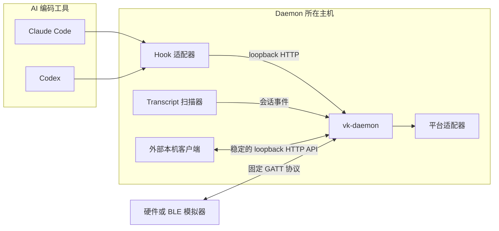
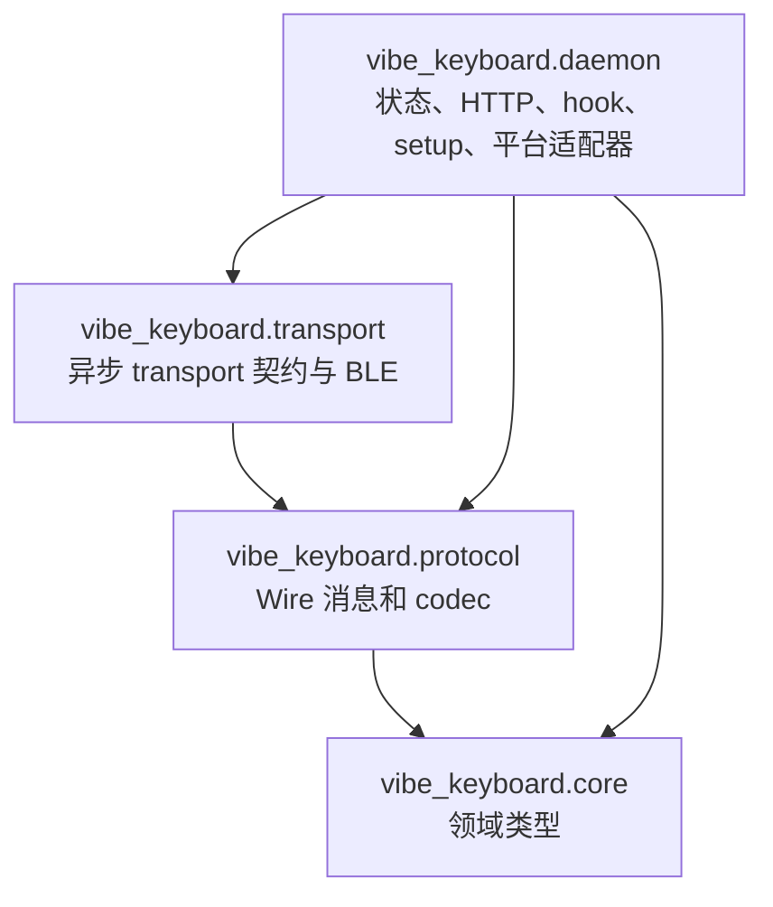
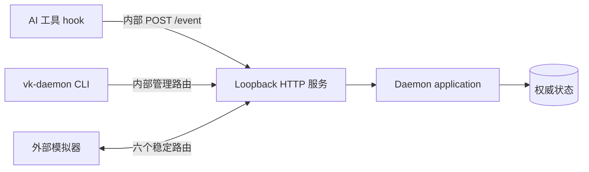
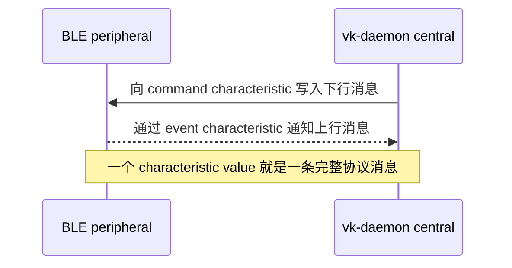
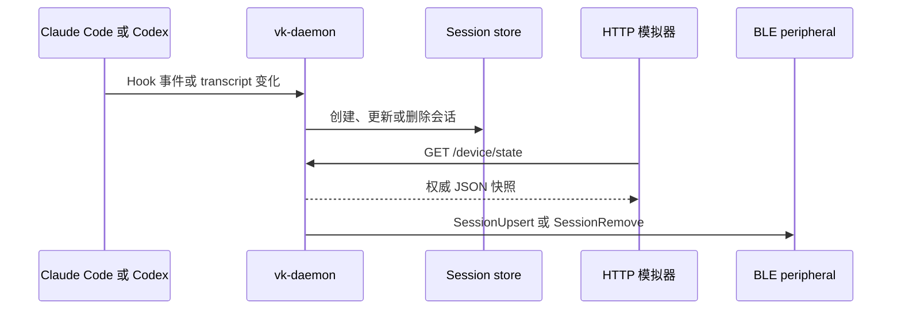
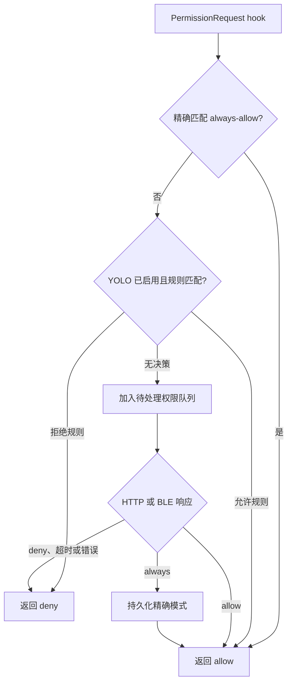

# Vibe Keyboard 架构

[English](architecture.md) | [简体中文](architecture.zh-CN.md)

Vibe Keyboard 是一个仅包含 daemon 的 Python 服务。`vk-daemon` 是唯一运行时进程，也是会话、
通知、待处理权限、当前会话选择、按键保持状态和持久化配置的权威所有者。

## 系统上下文

状态转换由 daemon 负责。HTTP 客户端和 BLE peripheral 负责呈现快照并提交操作意图，不会成为
另一份状态源。

## 包边界

| 包 | 职责 | 依赖规则 |
| --- | --- | --- |
| `vibe_keyboard.core` | 会话、通知、输入和状态领域类型 | 不依赖其他项目层 |
| `vibe_keyboard.protocol` | BLE 上行/下行记录和二进制 codec | 只依赖 core 类型 |
| `vibe_keyboard.transport` | `asyncio` transport 协议与可选 BLE central | 依赖 protocol/core |
| `vibe_keyboard.daemon` | 权威状态、HTTP、发现、审批、setup 和 OS 操作 | 组合所有下层模块 |

运行时依赖保持在 Python 标准库内；`bleak` 被隔离在可选的 `ble` extra 中。

## 运行时所有权

| 状态 | 所有者 | 持久性 | 消费方 |
| --- | --- | --- | --- |
| 会话与当前会话 | Daemon 内存 | 从 hook/transcript 重建 | HTTP、BLE、聚焦适配器 |
| 通知 | Daemon 内存 | 进程生命周期 | HTTP、BLE、系统通知器 |
| 待处理权限 | Daemon 内存 | 直到决策或超时 | Hook 等待方、HTTP、BLE |
| YOLO 与 always-allow 规则 | Daemon | TOML 配置 | 权限评估器、HTTP、BLE |
| 保持中的注入按键 | Daemon 内存 | 直到匹配 release 或进程退出 | HTTP 诊断 |
| BLE 同步缓存 | 单次 BLE 连接 | 断连时清除 | 增量下行同步 |

配置默认位于 `~/.config/vk-daemon/config.toml`。写入前会校验，并以原子方式替换。会话与通知
状态有意不跨 daemon 重启持久化。

## HTTP 边界

daemon 默认监听 `127.0.0.1:19280`，并拒绝非 loopback 地址。HTTP 同时承载内部 AI 工具集成
以及同机模拟器的稳定接口。

稳定的模拟器路由包括 `GET /device/state`、`GET /sessions`、`GET /notifications`、
`POST /button`、`POST /knob` 和 `POST /permissions/{id}`。`GET /device/state` 是原子快照接口，
客户端应优先用它完成初始加载和定期校准。

带 `Origin` 头的浏览器请求只接受 loopback origin。该机制能阻止任意网页调用本机 daemon，
但不等于远程身份认证。完整公共 JSON 契约见 [HTTP API 中文文档](docs/http_api.zh-CN.md)。

## BLE 边界

daemon 是 BLE central。硬件和 BLE 模拟器是 peripheral：广播固定 service，接受 command 写入，
并发送 event notification。

协议没有额外 stream envelope、校验和、应用层认证或协议级分片。command characteristic 必须支持
最多 500 字节的完整逻辑写入。UUID 和精确布局见 [BLE 协议中文文档](docs/ble_protocol.zh-CN.md)。

## 会话同步

Hook 事件和 transcript 发现结果会被规范化为领域事件。daemon 先提交每次变更，再将其暴露给
HTTP 快照或 BLE 更新。

新 BLE 连接建立后，daemon 先发送 `TimeSync`，再用 `SessionListClear` 和每个会话对应的
`SessionUpsert` 完成全量重建，随后发送通知、YOLO 状态和待处理权限。后续同步通过单连接缓存
只发送变化或删除的会话；重连会清空缓存并再次全量重建。

## 权限流程

权限处理采用 fail-closed。先检查已持久化的精确 always-allow 匹配，再检查 YOLO 拒绝/允许规则。
两者都不能决定时，请求进入待处理状态，等待 HTTP 或 BLE 显式决策。

HTTP 使用 `POST /permissions/{id}` 响应；BLE 使用上行 `PermissionResponse` (`0x06`)。`always`
会先持久化精确的 `tool_name(tool_input)` 值；写入失败时请求仍保持待处理，以便重试。默认等待
时间为 300 秒。

## 输入流程

按钮和旋钮事件从 HTTP 或 BLE 进入，并共用同一组 application handler。权限操作优先级最高：
存在待处理权限时，Send 表示允许，Cancel 表示拒绝。其他情况下，输入可切换当前会话、聚焦终端
窗口、注入 Enter/Escape、切换 YOLO 模式、调用配置的 Delete 宏，或启动和停止配置的 Voice
操作。macOS 默认 Voice 操作通过“双击 Fn”快捷键切换系统听写。

OS 适配器属于尽力执行的平台边界。聚焦、输入注入、必要状态持久化或其他必要操作失败时，HTTP
客户端会收到 `503`，同时 daemon 会记录日志。

## 并发与关闭

`asyncio` 协调 HTTP 服务、transcript 扫描器、BLE 重连循环和权限等待方。共享 application lock
保护复合状态读取和变更；需要阻塞的平台与文件操作通过工作线程执行。

收到 `SIGINT` 或 `SIGTERM` 后，daemon 会取消后台任务、清理并关闭当前 transport，再关闭 HTTP
服务。尚未完成的权限路径通过取消或超时逻辑默认拒绝。

## 安全与故障模型

- HTTP 只绑定 loopback；非 loopback 浏览器 origin 会被拒绝。
- 无效 JSON、枚举、数值范围、未知 tag 和截断 BLE 消息不会改变 daemon 状态。
- 权限超时、取消和内部失败都按拒绝处理。
- BLE 断连会清除连接状态；重连会执行权威全量同步。
- BLE 断连和 daemon 退出会释放仍保持的输入操作，包括正在进行的听写。
- BLE 发现会接受附近首个名称或 service UUID 匹配的 peripheral。协议没有身份或消息认证，因此
  daemon 附近只能由可信 peripheral 广播该 service。
- HTTP 不是跨主机控制协议。远端客户端必须通过可信 BLE peripheral 接入，或与 daemon 同机运行。

## 兼容性规则

BLE UUID、消息 tag、字段顺序、整数宽度和小端序是公共兼容边界。只有在提供明确协议版本和迁移
方案时才能修改。外部固件始终位于独立项目。

六个稳定 HTTP 模拟器路由及其 DTO 同样是兼容边界。内部 hook、setup、声音、配置、聚焦、健康
检查和诊断路由可随 daemon 演进，外部模拟器不能依赖它们。
