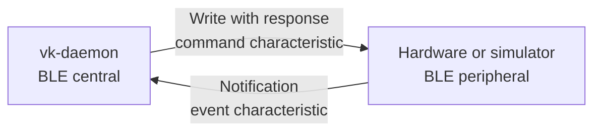
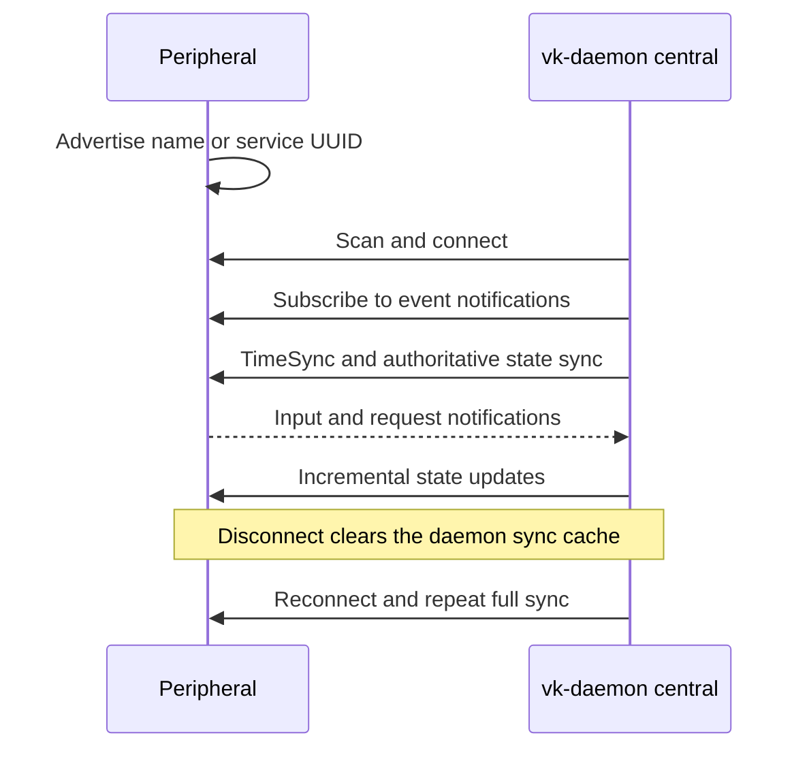
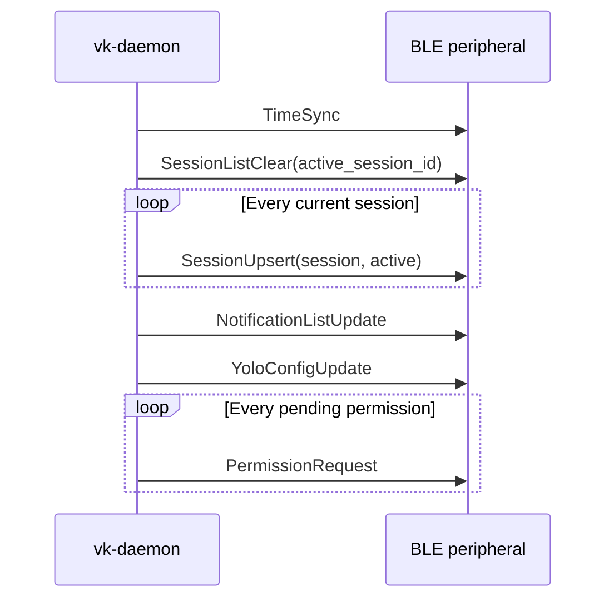
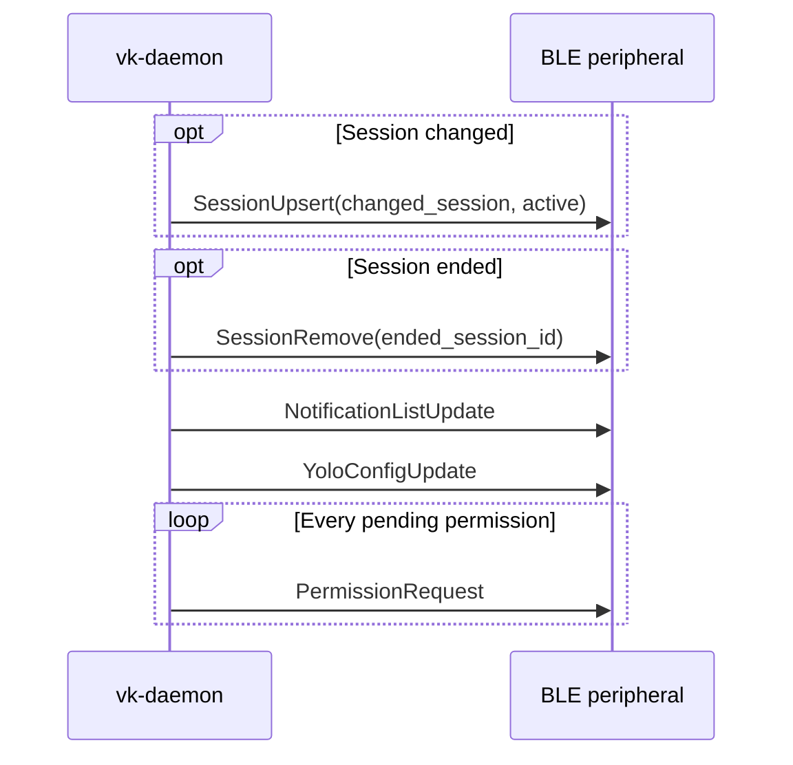

# Vibe Keyboard BLE Protocol

[English](ble_protocol.md) | [简体中文](ble_protocol.zh-CN.md)

This document defines the Bluetooth LE contract between `vk-daemon` and a hardware device or
external BLE simulator. Each BLE payload is the binary message produced by
`vibe_keyboard.protocol`, beginning with its one-byte tag and without any additional envelope.

## GATT

The hardware device or simulator acts as the BLE peripheral. The daemon acts as the BLE central.



```text
Device name:          VibeKeyboard
Service UUID:         5a5f5b5e-1234-5678-abcd-000000000001
Command char UUID:    5a5f5b5e-1234-5678-abcd-000000000002
Event char UUID:      5a5f5b5e-1234-5678-abcd-000000000003
```

- Daemon to peripheral: daemon writes one downlink message to the command characteristic with
  response.
- Peripheral to daemon: peripheral sends one uplink message as a notification on the event
  characteristic.
- Each BLE value is exactly one protocol message: `[tag:u8][fields...]`.
- There is no checksum, message id, or fragmentation layer in the current protocol.
- At `info` log level, the daemon logs each received notification's tag, byte count, first eight
  bytes, and decoded message type as `ble.uplink notification`; it never logs the full payload.

The daemon keeps its compacted BLE downlink snapshots at or below 500 bytes. The command
characteristic must accept one logical write-with-response value of up to 500 bytes. Depending on
the BLE stack and negotiated ATT MTU, that may require enabling long writes/prepare writes and
configuring a characteristic value length of at least 500 bytes. There is no protocol-level
fragmentation fallback. Peripherals should still reject malformed or incomplete packets gracefully.

### Peripheral Requirements

A BLE simulator follows the same contract as hardware:

1. Advertise the fixed service UUID above and preferably the `VibeKeyboard` device name.
2. Expose the command characteristic with write-with-response support for values up to 500 bytes.
3. Expose the event characteristic with notification support.
4. Send and receive exactly one complete protocol message per characteristic value.
5. Keep advertising so the daemon can reconnect after a disconnect.

The UUIDs are part of the public contract and are not configurable. A simulator must not act as a
central or wait for the daemon to advertise.

### Connection Lifecycle



### Trust Model

The daemon connects to the first nearby peripheral whose advertised device name is
`VibeKeyboard` or whose advertised service list contains the fixed service UUID. The protocol has
no application-level authentication, pairing identity, or message signature. Hardware and BLE
simulators must therefore be treated as trusted devices. In production environments, do not
advertise an imitation Vibe Keyboard service and do not run an untrusted simulator within radio
range of the daemon.

## Primitive Types

All integer and float values are little-endian.

```text
u8       1 byte unsigned integer
i16      2 byte signed integer, little-endian, two's complement
u16      2 byte unsigned integer, little-endian
u32      4 byte unsigned integer, little-endian
u64      8 byte unsigned integer, little-endian
f64      8 byte IEEE-754 float, little-endian
bool     u8, 0 = false, nonzero = true
color    3 bytes: r:u8, g:u8, b:u8
string   len:u16 followed by len bytes of UTF-8
```

The daemon encodes booleans as `0` or `1`. Firmware should decode any nonzero byte as true.

### Direction and Tag Ranges

| Direction | Tag range | Producer | Consumer |
| --- | --- | --- | --- |
| Uplink | `0x01` through `0x0C` | Peripheral event characteristic | Daemon |
| Downlink | `0x81` through `0x93` | Daemon command characteristic | Peripheral |

Tags not listed in this document are unassigned. Receivers should ignore or log unknown tags so a
new optional message does not force a disconnect. A known tag with malformed fields must be
rejected as a whole.

## Enums

### ButtonId

```text
0 delete
1 cancel
2 mode
3 session
4 send
5 voice
```

### Direction

```text
0 clockwise
1 counter_clockwise
```

### PermissionAction

```text
0 allow
1 deny
2 always
```

### SessionStatus

```text
0 thinking
1 tool_use
2 writing
3 done
4 error
5 idle
6 permission_needed
```

### SoundType

```text
0 permission_alert
1 session_complete
2 error
3 click
```

## Shared Records

### SessionInfo

Fields must be decoded in this exact order:

```text
id:u16
name:string
status:SessionStatus/u8
has_permission_request:bool
source:string
cwd:string
permission_mode:string
model:string
tokens_in:u64
tokens_out:u64
cost_usd:f64
context_pct:u8
last_message:string
last_ai_output:string
bundle_id:string
session_tty:string
started_at:u64
last_activity:u64
```

For BLE `SessionUpsert`, the daemon sends a compacted `SessionInfo`:

```text
name          max 35 UTF-8 bytes
source        max 23 UTF-8 bytes
model         max 23 UTF-8 bytes
last_message  max 128 UTF-8 bytes
```

`last_message` is the prompt if present, otherwise the last AI output. Some fields such as
`cwd`, `permission_mode`, `last_ai_output`, `bundle_id`, and `session_tty` may be empty on BLE.

### NotificationInfo

```text
id:u32
session_id:u16
session_name:string
status:SessionStatus/u8
description:string
timestamp:u64
read:bool
```

### SetupToolStatus

```text
id:string
name:string
detected:bool
hook_installed:bool
detail:string
```

Current AI tool ids include:

```text
claude-code
codex
cursor
```

## Uplink Messages

Uplink messages are sent by the peripheral to daemon through the event characteristic.

### 0x01 ButtonPress

```text
tag:u8 = 0x01
button:ButtonId/u8
```

### 0x02 ButtonRelease

```text
tag:u8 = 0x02
button:ButtonId/u8
```

### 0x03 KnobRotate

```text
tag:u8 = 0x03
direction:Direction/u8
steps:u8
```

`steps` is encoded as a `u8`. Peripherals should send a value in `1..255` for an actual rotation.

### 0x04 KnobPress

```text
tag:u8 = 0x04
```

### 0x05 KnobRelease

```text
tag:u8 = 0x05
```

### 0x06 PermissionResponse

```text
tag:u8 = 0x06
session_id:u16
action:PermissionAction/u8
```

### 0x07 SessionSwitch

```text
tag:u8 = 0x07
session_id:u16
```

Send this when the peripheral selects a session.

### 0x08 SetupActionRequest

```text
tag:u8 = 0x08
request_id:u32
action_id:u8
tool:string
command:string
daemon_port:u16
```

Current daemon command strings include:

```text
install_hook
uninstall_hook
install_tool
uninstall_tool
```

`request_id` correlates the later `SetupActionResult`. `action_id` is retained wire metadata and
is not interpreted by the current daemon; `command` selects the operation. Unknown command strings
produce `success = false`.

### 0x09 SetupStatusRequest

Requests the daemon's current setup status for supported AI tools.

```text
tag:u8 = 0x09
request_id:u32
daemon_port:u16
```

Use `daemon_port = 0` to let the daemon use its configured hook port. The response uses the same
`request_id` in `SetupStatusUpdate`.

### 0x0A TimeSyncRequest

Requests a fresh wall-clock value from the daemon.

```text
tag:u8 = 0x0A
```

Firmware may send this after connecting and whenever it wants to correct RTC drift. The response
is `TimeSync`. The daemon also sends `TimeSync` proactively when a BLE connection is established,
so this request is optional during initial connection setup.

### 0x0B YoloConfigRequest

Requests the daemon's complete current YOLO configuration.

```text
tag:u8 = 0x0B
```

The response is `YoloConfigUpdate`. Firmware should send this when opening its YOLO settings
screen. The daemon also sends a configuration snapshot during initial device synchronization.

### 0x0C YoloConfigSet

Replaces the daemon's persisted YOLO configuration and returns the authoritative saved value in a
`YoloConfigUpdate` response.

```text
tag:u8 = 0x0C
active:bool
notify_auto_allow:bool
allow_count:u8
allow:string[allow_count]
deny_count:u8
deny:string[deny_count]
```

Rules use the same case-sensitive glob syntax as the daemon configuration, for example `Read(*)`
and `Bash(git push*)`. Empty rule lists are valid. Deny rules take precedence over allow rules.

## Downlink Messages

Downlink messages are written by daemon to the peripheral through the command characteristic.

### 0x81 SessionListUpdate

Legacy full-list update retained for binary-codec compatibility. Current BLE peripherals should
support the incremental session messages below instead.

```text
tag:u8 = 0x81
count:u8
sessions:SessionInfo[count]
active_index:u8
```

### 0x82 SessionStatusChange

```text
tag:u8 = 0x82
session_id:u16
status:SessionStatus/u8
```

This is a small status-only update. A peripheral may either apply it directly to the local session
table or wait for the next `SessionUpsert`.

### 0x83 PermissionRequest

```text
tag:u8 = 0x83
session_id:u16
action_desc:string
```

Present the request to the operator and answer with `PermissionResponse` (`0x06`).

For BLE, the daemon truncates `action_desc` on a UTF-8 boundary so the complete encoded message
is at most 500 bytes and fits in one CoreBluetooth/NimBLE GATT write.

### 0x84 SetLed

```text
tag:u8 = 0x84
button:ButtonId/u8
color:color
blink:bool
```

### 0x85 SetKnobRing

```text
tag:u8 = 0x85
color:color
```

### 0x86 PlaySound

```text
tag:u8 = 0x86
sound:SoundType/u8
```

### 0x87 DismissPermission

```text
tag:u8 = 0x87
session_id:u16
```

After a permission is resolved, the daemon removes its `permission_needed` notification before
sending the next authoritative `NotificationListUpdate`. A later reconnect therefore does not
restore an already resolved permission notification.

### 0x88 FrameData

```text
tag:u8 = 0x88
width:u16
height:u16
pixel_byte_length:u32
pixels:byte[pixel_byte_length]
```

This is a reserved legacy codec variant. The daemon does not write `FrameData` over BLE, so a
peripheral may ignore this tag.

### 0x89 NotificationListUpdate

```text
tag:u8 = 0x89
count:u8
notifications:NotificationInfo[count]
```

For BLE, the daemon considers at most the first 32 notifications. It truncates `session_name` to
35 UTF-8 bytes and `description` to 160 UTF-8 bytes, and stops adding rows before the complete
encoded message exceeds 500 bytes. Consequently, long rows can reduce the number of notifications
included in one CoreBluetooth/NimBLE GATT write below 32.

### 0x8A SetVolume

```text
tag:u8 = 0x8A
volume:u8
```

### 0x8B SetMuted

```text
tag:u8 = 0x8B
muted:bool
```

### 0x8C SetSoundMapping

```text
tag:u8 = 0x8C
sound_type:SoundType/u8
sound_id:string
```

### 0x8D SetupActionResult

```text
tag:u8 = 0x8D
request_id:u32
success:bool
```

### 0x8E SessionListClear

Starts a BLE session resync.

```text
tag:u8 = 0x8E
active_session_id:u16
```

Peripheral behavior:

1. Clear the local session table.
2. Store `active_session_id` if it is nonzero.
3. Wait for following `SessionUpsert` messages to repopulate the table.

### 0x8F SessionUpsert

Adds or updates one session.

```text
tag:u8 = 0x8F
session:SessionInfo
active:bool
```

Firmware behavior:

1. Decode `SessionInfo`.
2. If a session with the same `id` exists, replace or merge it.
3. If no session with that `id` exists, append it.
4. If `active` is true, set the active session to `session.id`.
5. Publish the updated local session state after applying the message.

This is the primary BLE session synchronization message.

### 0x90 SessionRemove

Removes one session.

```text
tag:u8 = 0x90
session_id:u16
```

Peripheral behavior:

1. Remove the session with `session_id` if present.
2. If the removed session was active, choose another local session or clear the active selection.
3. Publish the updated local session state.

### 0x91 SetupStatusUpdate

Returns the current install/detection state for supported AI tools.

```text
tag:u8 = 0x91
request_id:u32
count:u8
tools:SetupToolStatus[count]
```

A peripheral can match `tools[].id` against `claude-code` and `codex` when exposing setup actions.
`hook_installed` is the authoritative hook state, and `detected` tells whether the tool or its
config directory was found locally. Current Codex installs report `approval hook` when the
`PermissionRequest` lifecycle hook is configured; the separate top-level `notify` command remains
responsible for turn-complete status updates.

### 0x92 TimeSync

Synchronizes the peripheral wall clock with the computer running `vk-daemon`.

```text
tag:u8 = 0x92
unix_time_ms:u64
utc_offset_minutes:i16
```

`unix_time_ms` is milliseconds since `1970-01-01T00:00:00Z`. It is always a UTC epoch value.
`utc_offset_minutes` is the daemon computer's current local offset from UTC, including the current
daylight-saving adjustment. For example, UTC+08:00 is `480` and UTC-07:00 is `-420`.

The peripheral should set its system/RTC clock from `unix_time_ms` without adding the UTC offset.
Use `utc_offset_minutes` only when converting UTC to local time. Because the offset can change at a
daylight-saving transition, peripherals in such regions should send `TimeSyncRequest` periodically;
every six hours is sufficient.

### 0x93 YoloConfigUpdate

Returns the authoritative YOLO state during every device snapshot synchronization, including after
connection, an explicit query, or a successful update.

```text
tag:u8 = 0x93
active:bool
notify_auto_allow:bool
allow_count:u8
allow:string[allow_count]
deny_count:u8
deny:string[deny_count]
```

The peripheral must replace its local YOLO state and rule lists with this snapshot. It must not
interpret the `SessionInfo.permission_mode` field as the YOLO state.

The daemon rejects persisted YOLO rule lists whose encoded update would exceed 500 bytes. Every
accepted configuration therefore fits in one GATT write and this snapshot always contains the
complete authoritative allow and deny lists.

## BLE Session Synchronization Flow

On a new BLE connection, daemon sends:



After that, daemon keeps a per-connection cache for session records. A device snapshot sync sends
only changed session records, then repeats the authoritative notification list, YOLO configuration,
and each currently pending permission:



If the BLE connection is lost and reconnected, daemon clears its cache and sends a fresh
`SessionListClear + SessionUpsert...` sequence.

## Codec Test Vectors

The following complete payloads can be used as initial firmware smoke tests. Spaces only separate
bytes and are not transmitted.

| Message | Fields | Hex payload |
| --- | --- | --- |
| `ButtonPress` | `button = send (4)` | `01 04` |
| `KnobRotate` | `clockwise (0), steps = 3` | `03 00 03` |
| `PermissionResponse` | `session_id = 17, allow (0)` | `06 11 00 00` |
| `TimeSyncRequest` | no fields | `0A` |
| `DismissPermission` | `session_id = 17` | `87 11 00` |

For string-bearing messages, remember that the `u16` prefix is the UTF-8 byte count, not the
number of Unicode code points.

## Compatibility Checklist

- Do not change the three GATT UUIDs or swap characteristic directions.
- Do not renumber tags or enum values.
- Preserve field order, widths, signedness, and little-endian encoding.
- Preserve `u16` UTF-8 byte-length prefixes and `u8` array counts.
- Accept the complete 500-byte logical command write.
- Rebuild state after `SessionListClear`; do not treat incremental records as a full list.
- Ignore unknown future tags, but reject malformed known messages without partially applying them.
- Add a versioned migration before making any incompatible wire change.

## Peripheral Implementation Notes

- Parse one BLE characteristic value as one complete message.
- Configure the command characteristic for 500-byte values and enable the stack's long-write path;
  the default 20-byte or 244-byte value limit is insufficient for the largest daemon snapshots.
- Unknown tags should be ignored or logged, not treated as a fatal connection error.
- Validate enough bytes remain before each field read.
- Decode and retain strings as UTF-8.
- Store sessions by `id:u16`.
- Keep insertion order for new sessions. Updating an existing session should not move it unless
  the peripheral intentionally applies another ordering policy.
- Treat `active=true` on `SessionUpsert` as authoritative.
- `SessionListClear.active_session_id == 0` means no active session is known.
- Decode `unix_time_ms` before converting to a system time API: seconds are
  `unix_time_ms / 1000` and microseconds are `(unix_time_ms % 1000) * 1000`.
- Send `TimeSyncRequest` after large sleep intervals or suspected clock drift. Duplicate
  `TimeSync` messages are safe and should replace the previously stored clock and UTC offset.
