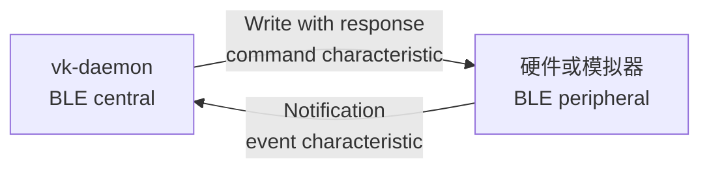
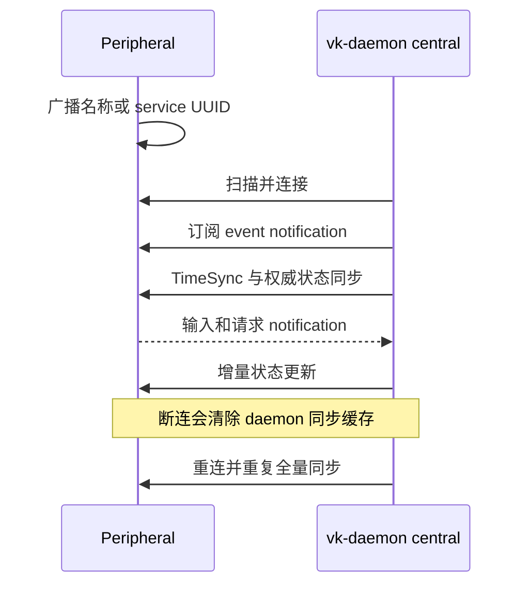
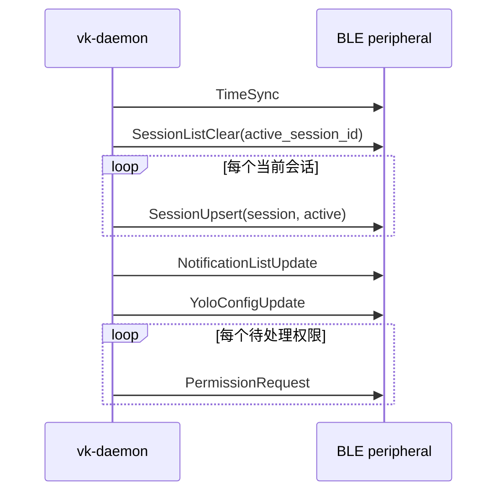
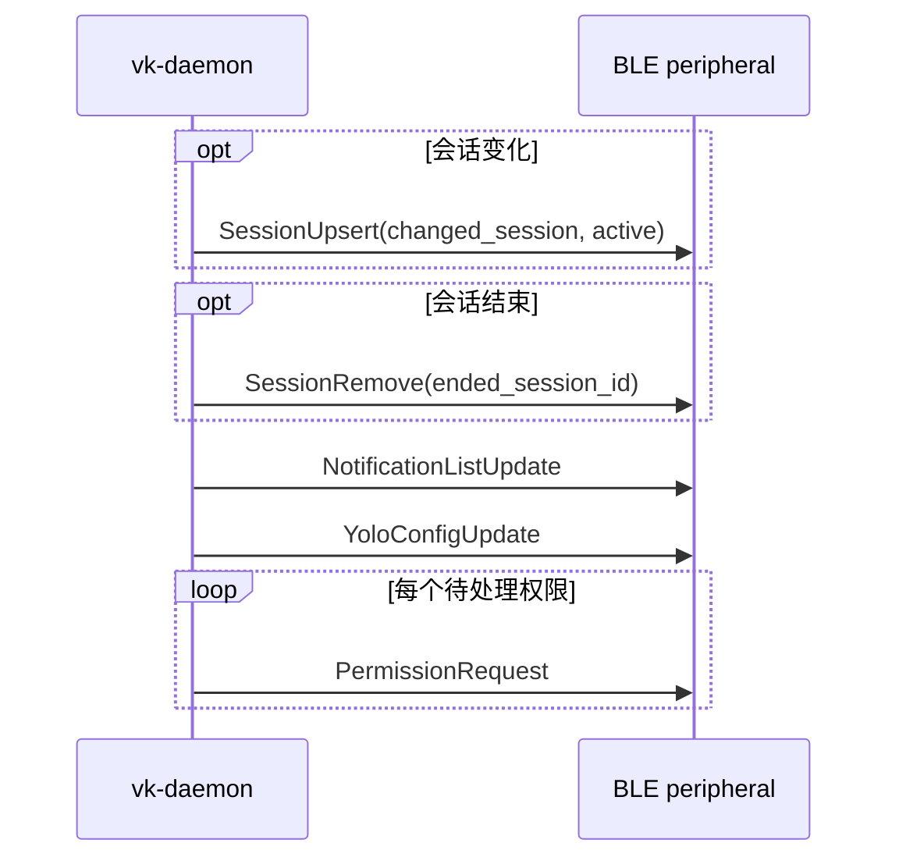

# Vibe Keyboard BLE 协议

[English](ble_protocol.md) | [简体中文](ble_protocol.zh-CN.md)

本文定义 `vk-daemon` 与硬件设备或外部 BLE 模拟器之间的 Bluetooth LE 契约。每个 BLE payload
都是 `vibe_keyboard.protocol` 生成的一条二进制消息，以单字节 tag 开头，没有额外 envelope。

## GATT

硬件设备或模拟器充当 BLE peripheral，daemon 充当 BLE central。



```text
Device name:          VibeKeyboard
Service UUID:         5a5f5b5e-1234-5678-abcd-000000000001
Command char UUID:    5a5f5b5e-1234-5678-abcd-000000000002
Event char UUID:      5a5f5b5e-1234-5678-abcd-000000000003
```

- Daemon 到 peripheral：daemon 通过 command characteristic 写入一条下行消息，要求响应。
- Peripheral 到 daemon：peripheral 通过 event characteristic notification 发送一条上行消息。
- 每个 BLE value 恰好是一条协议消息：`[tag:u8][fields...]`。
- 当前协议没有校验和、消息 id 或分片层。
- daemon 在 `info` 日志级别记录每条上行 notification 的 tag、字节数、前 8 字节和解码消息
  类型，日志名为 `ble.uplink notification`；不会打印完整 payload。

daemon 将压缩后的 BLE 下行快照控制在 500 字节以内。command characteristic 必须接受最多
500 字节的单次逻辑 write-with-response。根据 BLE stack 和协商的 ATT MTU，可能需要启用 long
write/prepare write，并把 characteristic value 长度配置为至少 500 字节。协议没有分片回退；
peripheral 仍应安全拒绝格式错误或不完整的 packet。

### Peripheral 要求

1. 广播固定 service UUID，并建议同时广播 `VibeKeyboard` 设备名。
2. command characteristic 支持最多 500 字节的 write-with-response。
3. event characteristic 支持 notification。
4. 每个 characteristic value 只收发一条完整协议消息。
5. 断连后继续广播，使 daemon 可以重连。

UUID 是不可配置的公共契约。模拟器不能充当 central，也不能等待 daemon 广播。

### 连接生命周期



### 信任模型

daemon 会连接附近首个设备名为 `VibeKeyboard` 或广播列表包含固定 service UUID 的 peripheral。
协议没有应用层认证、配对身份或消息签名，因此硬件和 BLE 模拟器都必须视为可信设备。生产环境中
不要广播仿冒 service，也不要在 daemon 无线范围内运行不可信模拟器。

## 原始类型

所有整数和浮点数都使用小端序。

```text
u8       1 字节无符号整数
i16      2 字节有符号整数，小端序，二进制补码
u16      2 字节无符号整数，小端序
u32      4 字节无符号整数，小端序
u64      8 字节无符号整数，小端序
f64      8 字节 IEEE-754 浮点数，小端序
bool     u8，0 = false，非零 = true
color    3 字节：r:u8, g:u8, b:u8
string   len:u16，随后是 len 字节 UTF-8
```

daemon 只编码 `0` 或 `1` 作为 bool；固件应把任意非零值解码为 true。

### 方向与 Tag 范围

| 方向 | Tag 范围 | 发送方 | 接收方 |
| --- | --- | --- | --- |
| 上行 | `0x01` 到 `0x0C` | Peripheral event characteristic | Daemon |
| 下行 | `0x81` 到 `0x93` | Daemon command characteristic | Peripheral |

本文未列出的 tag 尚未分配。接收方应忽略或记录未知 tag，避免新增可选消息导致断连；已知 tag 的
字段格式错误时，必须整条拒绝，不能部分应用。

## 枚举

### ButtonId

```text
0 delete
1 cancel
2 mode
3 session
4 send
5 voice
```

### Direction

```text
0 clockwise
1 counter_clockwise
```

### PermissionAction

```text
0 allow
1 deny
2 always
```

### SessionStatus

```text
0 thinking
1 tool_use
2 writing
3 done
4 error
5 idle
6 permission_needed
```

### SoundType

```text
0 permission_alert
1 session_complete
2 error
3 click
```

## 共享记录

### SessionInfo

字段必须严格按以下顺序解码：

```text
id:u16
name:string
status:SessionStatus/u8
has_permission_request:bool
source:string
cwd:string
permission_mode:string
model:string
tokens_in:u64
tokens_out:u64
cost_usd:f64
context_pct:u8
last_message:string
last_ai_output:string
bundle_id:string
session_tty:string
started_at:u64
last_activity:u64
```

BLE `SessionUpsert` 中的 `SessionInfo` 会被 daemon 压缩：

```text
name          最多 35 UTF-8 字节
source        最多 23 UTF-8 字节
model         最多 23 UTF-8 字节
last_message  最多 128 UTF-8 字节
```

有 prompt 时 `last_message` 是 prompt，否则使用最后一段 AI 输出。BLE 中的 `cwd`、
`permission_mode`、`last_ai_output`、`bundle_id` 和 `session_tty` 等字段可能为空。

### NotificationInfo

```text
id:u32
session_id:u16
session_name:string
status:SessionStatus/u8
description:string
timestamp:u64
read:bool
```

### SetupToolStatus

```text
id:string
name:string
detected:bool
hook_installed:bool
detail:string
```

当前 AI 工具 id 包括 `claude-code`、`codex` 和 `cursor`。

## 上行消息

上行消息由 peripheral 通过 event characteristic 发送给 daemon。

### 0x01 ButtonPress

```text
tag:u8 = 0x01
button:ButtonId/u8
```

### 0x02 ButtonRelease

```text
tag:u8 = 0x02
button:ButtonId/u8
```

### 0x03 KnobRotate

```text
tag:u8 = 0x03
direction:Direction/u8
steps:u8
```

实际旋转时，`steps` 应为 `1..255`。

### 0x04 KnobPress

```text
tag:u8 = 0x04
```

### 0x05 KnobRelease

```text
tag:u8 = 0x05
```

### 0x06 PermissionResponse

```text
tag:u8 = 0x06
session_id:u16
action:PermissionAction/u8
```

### 0x07 SessionSwitch

```text
tag:u8 = 0x07
session_id:u16
```

peripheral 选择会话时发送。

### 0x08 SetupActionRequest

```text
tag:u8 = 0x08
request_id:u32
action_id:u8
tool:string
command:string
daemon_port:u16
```

当前 daemon command 字符串包括：

```text
install_hook
uninstall_hook
install_tool
uninstall_tool
```

`request_id` 用于关联后续 `SetupActionResult`。`action_id` 是保留的 wire 元数据，当前 daemon
不会解释它；实际操作由 `command` 选择。未知 command 字符串会得到 `success = false`。

### 0x09 SetupStatusRequest

请求 daemon 返回受支持 AI 工具的当前 setup 状态。

```text
tag:u8 = 0x09
request_id:u32
daemon_port:u16
```

`daemon_port = 0` 表示使用 daemon 配置的 hook 端口。响应 `SetupStatusUpdate` 使用相同
`request_id`。

### 0x0A TimeSyncRequest

请求 daemon 返回最新墙上时间。

```text
tag:u8 = 0x0A
```

固件可在连接后或校正 RTC 漂移时发送；响应为 `TimeSync`。daemon 建连时也会主动发送
`TimeSync`，因此初始连接阶段不强制请求。

### 0x0B YoloConfigRequest

请求 daemon 的完整当前 YOLO 配置。

```text
tag:u8 = 0x0B
```

响应为 `YoloConfigUpdate`。打开 YOLO 设置界面时应发送此消息；初始设备同步也包含配置快照。

### 0x0C YoloConfigSet

替换 daemon 持久化的 YOLO 配置；daemon 通过 `YoloConfigUpdate` 返回最终保存的权威值。

```text
tag:u8 = 0x0C
active:bool
notify_auto_allow:bool
allow_count:u8
allow:string[allow_count]
deny_count:u8
deny:string[deny_count]
```

规则使用与 daemon 配置相同且区分大小写的 glob 语法，例如 `Read(*)` 和 `Bash(git push*)`。
规则列表可以为空，拒绝规则优先于允许规则。

## 下行消息

下行消息由 daemon 通过 command characteristic 写给 peripheral。

### 0x81 SessionListUpdate

为二进制 codec 兼容而保留的旧版全列表更新。当前 peripheral 应支持后文的增量会话消息。

```text
tag:u8 = 0x81
count:u8
sessions:SessionInfo[count]
active_index:u8
```

### 0x82 SessionStatusChange

```text
tag:u8 = 0x82
session_id:u16
status:SessionStatus/u8
```

这是仅包含状态的小型更新。peripheral 可直接更新本地会话表，也可等待下一条 `SessionUpsert`。

### 0x83 PermissionRequest

```text
tag:u8 = 0x83
session_id:u16
action_desc:string
```

向操作者呈现请求，再用 `PermissionResponse` (`0x06`) 回答。daemon 会在 UTF-8 边界截断
`action_desc`，保证完整消息不超过 500 字节。

### 0x84 SetLed

```text
tag:u8 = 0x84
button:ButtonId/u8
color:color
blink:bool
```

### 0x85 SetKnobRing

```text
tag:u8 = 0x85
color:color
```

### 0x86 PlaySound

```text
tag:u8 = 0x86
sound:SoundType/u8
```

### 0x87 DismissPermission

```text
tag:u8 = 0x87
session_id:u16
```

权限处理完成后，daemon 会先删除对应的 `permission_needed` 通知，再发送下一条权威
`NotificationListUpdate`。因此，设备后续重连时不会恢复已经处理过的权限通知。

### 0x88 FrameData

```text
tag:u8 = 0x88
width:u16
height:u16
pixel_byte_length:u32
pixels:byte[pixel_byte_length]
```

这是保留的旧版 codec variant。daemon 不会通过 BLE 写入 `FrameData`，peripheral 可忽略。

### 0x89 NotificationListUpdate

```text
tag:u8 = 0x89
count:u8
notifications:NotificationInfo[count]
```

daemon 最多考虑前 32 条通知，并将 `session_name` 截断到 35 UTF-8 字节、`description` 截断到
160 UTF-8 字节；添加通知时会在完整消息超过 500 字节前停止，保证一次 GATT 写入可以承载。
因此，通知文本较长时，单次更新实际包含的通知数会少于 32 条。

### 0x8A SetVolume

```text
tag:u8 = 0x8A
volume:u8
```

### 0x8B SetMuted

```text
tag:u8 = 0x8B
muted:bool
```

### 0x8C SetSoundMapping

```text
tag:u8 = 0x8C
sound_type:SoundType/u8
sound_id:string
```

### 0x8D SetupActionResult

```text
tag:u8 = 0x8D
request_id:u32
success:bool
```

### 0x8E SessionListClear

开始一次 BLE 会话重同步。

```text
tag:u8 = 0x8E
active_session_id:u16
```

peripheral 应清空本地会话表；若 `active_session_id` 非零则先保存它，再等待后续
`SessionUpsert` 重建表。

### 0x8F SessionUpsert

新增或更新一个会话。

```text
tag:u8 = 0x8F
session:SessionInfo
active:bool
```

固件应按以下顺序处理：

1. 解码 `SessionInfo`。
2. 相同 `id` 已存在时替换或合并；不存在时追加。
3. `active` 为 true 时，将当前会话设为 `session.id`。
4. 完整应用消息后再发布本地会话状态。

这是主要的 BLE 会话同步消息。

### 0x90 SessionRemove

```text
tag:u8 = 0x90
session_id:u16
```

删除对应本地会话。若它是当前会话，选择其他会话或清空选择；完整应用后再发布状态。

### 0x91 SetupStatusUpdate

```text
tag:u8 = 0x91
request_id:u32
count:u8
tools:SetupToolStatus[count]
```

显示 setup 操作时，可将 `tools[].id` 与 `claude-code`、`codex` 匹配。`hook_installed` 是权威
hook 状态；`detected` 表示发现了工具或其配置目录。当前 Codex 安装在配置 `PermissionRequest`
生命周期 hook 后报告 `approval hook`；独立的顶层 `notify` 命令仍负责上报 turn 完成状态。

### 0x92 TimeSync

将 peripheral 时钟与运行 `vk-daemon` 的电脑同步。

```text
tag:u8 = 0x92
unix_time_ms:u64
utc_offset_minutes:i16
```

`unix_time_ms` 是自 `1970-01-01T00:00:00Z` 起的毫秒数，始终是 UTC epoch。`utc_offset_minutes`
是 daemon 主机当前相对 UTC 的本地偏移，包含当时的夏令时修正；例如 UTC+08:00 为 `480`，
UTC-07:00 为 `-420`。

设置系统/RTC 时钟时不要再加 UTC offset。offset 只用于把 UTC 转为本地时间。存在夏令时变化的
地区应定期发送 `TimeSyncRequest`；每六小时一次足够。

### 0x93 YoloConfigUpdate

```text
tag:u8 = 0x93
active:bool
notify_auto_allow:bool
allow_count:u8
allow:string[allow_count]
deny_count:u8
deny:string[deny_count]
```

每次设备快照同步都会返回权威 YOLO 状态，包括连接、显式查询和成功更新之后。peripheral 必须用
该快照替换本地 YOLO 状态和规则列表，不能把 `SessionInfo.permission_mode` 当作 YOLO 状态。

daemon 会拒绝编码后超过 500 字节的 YOLO 规则，因此所有已接受配置都能通过单次 GATT 写入发送，
且快照始终包含完整的 allow 和 deny 列表。

## BLE 会话同步流程

新连接的全量同步：



此后 daemon 为当前连接维护会话缓存。快照同步只发送变化和删除的会话，再重复权威通知列表、
YOLO 配置和每个待处理权限：



BLE 断连并重连后，daemon 会清空缓存，重新发送 `SessionListClear + SessionUpsert...` 全量序列。

## Codec 测试向量

以下完整 payload 可用于固件初始 smoke test。空格仅用于分隔字节，不参与传输。

| 消息 | 字段 | 十六进制 payload |
| --- | --- | --- |
| `ButtonPress` | `button = send (4)` | `01 04` |
| `KnobRotate` | `clockwise (0), steps = 3` | `03 00 03` |
| `PermissionResponse` | `session_id = 17, allow (0)` | `06 11 00 00` |
| `TimeSyncRequest` | 无字段 | `0A` |
| `DismissPermission` | `session_id = 17` | `87 11 00` |

含字符串的消息中，`u16` 前缀表示 UTF-8 字节数，而不是 Unicode code point 数量。

## Peripheral 实现注意事项

- 把一个 BLE characteristic value 解析为一条完整消息。
- command characteristic 配置为 500 字节并启用 stack 的 long-write 路径；默认 20 或 244 字节
  上限无法容纳最大快照。
- 忽略或记录未知 tag，不要将其视为致命连接错误。
- 读取每个字段前检查剩余字节是否足够；完整解码后再改变状态。
- 字符串按 UTF-8 解码和保存；会话按 `id:u16` 存储。
- 新会话保持插入顺序；更新现有会话不应改变位置，除非 peripheral 明确采用其他排序策略。
- `SessionUpsert.active=true` 是权威值；`SessionListClear.active_session_id == 0` 表示无已知当前会话。
- 设置时间时，秒数为 `unix_time_ms / 1000`，微秒为 `(unix_time_ms % 1000) * 1000`。
- 长时间休眠或怀疑时钟漂移后发送 `TimeSyncRequest`；重复 `TimeSync` 可安全覆盖旧值。

## 兼容性检查表

- 不得修改三个 GATT UUID 或交换 characteristic 方向。
- 不得重编号 tag 或枚举值。
- 保持字段顺序、宽度、有无符号和小端序。
- 保持 `u16` UTF-8 字节长度前缀和 `u8` array count。
- 接受完整的 500 字节逻辑 command write。
- 收到 `SessionListClear` 后重建状态，不能把增量记录当成完整列表。
- 忽略未来未知 tag，但格式错误的已知消息不能部分应用。
- 任何不兼容 wire 变更都必须先提供带版本的迁移方案。
