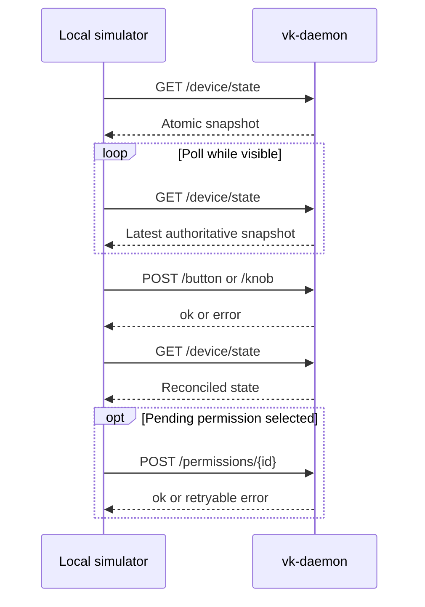

# Vibe Keyboard HTTP API

[English](http_api.md) | [简体中文](http_api.zh-CN.md)

This document defines the stable HTTP contract for an external simulator running on the same
computer as `vk-daemon`.

## Connection and Encoding

```text
Base URL: http://127.0.0.1:19280
Content-Type: application/json; charset=utf-8
```

The server accepts loopback connections only. It refuses a non-loopback bind and rejects browser
requests whose `Origin` is not loopback. This API has no remote authentication boundary; do not
expose it through a reverse proxy, port forward, LAN address, or public tunnel.

Browser-based simulators must be served from an `http://localhost`, `http://127.0.0.1`, or
`http://[::1]` origin. The daemon answers their CORS preflight requests and echoes the accepted
loopback origin on API responses.

All request bodies below are JSON objects. Successful mutation responses contain `"ok": true`.
Errors are JSON objects containing a non-empty `error` string.

The server implements HTTP/1.0 and HTTP/1.1 with one request per connection and always sends
`Connection: close` and `Cache-Control: no-store`. Chunked transfer encoding is not supported.
Headers are limited to 64 KiB, the HTTP body is limited to 5 MiB, and JSON routes accept at most
1 MiB. Simulator requests are expected to be much smaller.

## Endpoint Summary

| Method | Path | Purpose |
| --- | --- | --- |
| `GET` | `/device/state` | Read one authoritative daemon/device snapshot |
| `GET` | `/sessions` | Read the current session collection |
| `GET` | `/notifications` | Read unread and historical notifications |
| `POST` | `/button` | Send one button action |
| `POST` | `/knob` | Send one rotary encoder action |
| `POST` | `/permissions/{id}` | Resolve a pending permission for a session |

These routes are the external simulator surface. AI-tool hook and daemon-management routes are
internal integrations and may evolve separately.

## Recommended Client Flow



The API has no event stream and does not promise change versions or conditional requests. Treat
mutation responses as command results and fetch a new snapshot to reconcile rendered state.
Choose a polling interval appropriate for the UI; avoid parallel polling loops that can return in
an unexpected order.

## Data Types

### Session

```json
{
  "id": 17,
  "name": "Implement HTTP simulator",
  "status": "permission_needed",
  "has_permission": true,
  "source": "codex",
  "cwd": "/Users/example/project",
  "permission_mode": "default",
  "model": "gpt-5",
  "tokens_in": 3200,
  "tokens_out": 840,
  "cost_usd": 0.12,
  "context_pct": 18,
  "last_message": "Run the tests",
  "last_ai_output": "I need approval to continue.",
  "bundle_id": "com.example.terminal",
  "session_tty": "/dev/ttys004",
  "started_at": 1784700000,
  "last_activity": 1784700060
}
```

`status` is one of `thinking`, `tool_use`, `writing`, `done`, `error`, `idle`, or
`permission_needed`. Time fields are Unix seconds. `context_pct` is an integer from 0 through 100.
The API field is named `has_permission`; clients must not expect the internal domain name
`has_permission_request`.

Session `id` values are daemon-local unsigned identifiers. They can be reused after a daemon
restart and must not be treated as globally stable identities. Empty strings and zero-valued
metrics mean the corresponding AI-tool integration did not provide that metadata.

### Notification

```json
{
  "id": 4,
  "session_id": 17,
  "session_name": "Implement HTTP simulator",
  "status": "permission_needed",
  "description": "Bash(uv run pytest)",
  "timestamp": 1784700060,
  "read": false
}
```

`status` uses the same enum as a session. `timestamp` is Unix seconds.

### Pending Permission

```json
{
  "session_id": 17,
  "tool_name": "Bash",
  "tool_input": "uv run pytest"
}
```

`session_id` is also the `{id}` used by the permission decision endpoint.

### YOLO Configuration

```json
{
  "active": false,
  "allow": ["Read(*)", "Glob(*)", "Grep(*)"],
  "deny": ["Bash(git push*)", "Bash(rm -rf*)", "Bash(sudo*)"],
  "notify_auto_allow": true,
  "auto_allow_log": true
}
```

Rules use case-sensitive glob matching. Deny rules take precedence over allow rules.
The combined rule lists must encode to at most 500 bytes so the complete configuration remains
available over BLE.

## GET /device/state

Returns an atomic snapshot. The top-level object contains exactly these fields:

```json
{
  "active_session_id": 17,
  "ble_connected": true,
  "sessions": [],
  "notifications": [],
  "pending_permissions": [],
  "held_keys": [],
  "yolo": {
    "active": false,
    "allow": ["Read(*)", "Glob(*)", "Grep(*)"],
    "deny": ["Bash(git push*)", "Bash(rm -rf*)", "Bash(sudo*)"],
    "notify_auto_allow": true,
    "auto_allow_log": true
  }
}
```

Response fields:

| Field | Type | Meaning |
| --- | --- | --- |
| `active_session_id` | integer or `null` | Daemon-selected session |
| `ble_connected` | boolean | Whether the daemon currently has a connected BLE peripheral |
| `sessions` | Session array | Same DTOs returned by `GET /sessions` |
| `notifications` | Notification array | Same DTOs returned by `GET /notifications` |
| `pending_permissions` | Pending Permission array | Unresolved permission requests |
| `held_keys` | string array | Sorted daemon-injected keys that are currently held |
| `yolo` | YOLO Configuration | Current effective automatic-decision configuration |

Use this endpoint for initial state and regular polling. The collection endpoints are useful when
a client only needs one frequently refreshed list.

The snapshot is authoritative at the instant it is created, but a hook or device event may update
state immediately afterward. Clients should replace their local collections from each snapshot
instead of trying to merge records that disappeared.

## GET /sessions

Returns a JSON array of Session objects. An idle daemon returns an empty array.

```http
GET /sessions HTTP/1.1
Host: 127.0.0.1:19280
```

```json
[]
```

## GET /notifications

Returns a JSON array of Notification objects. Unread notifications are ordered first by daemon
priority, followed by read history. No notifications returns an empty array.

```http
GET /notifications HTTP/1.1
Host: 127.0.0.1:19280
```

```json
[]
```

## POST /button

Sends a logical button action.

```json
{
  "id": "send",
  "action": "click"
}
```

`id` must be one of `delete`, `cancel`, `mode`, `session`, `send`, or `voice`. `action` must be one
of `click`, `down`, `up`, or `toggle`. Clients that send `down` are responsible for sending the
matching `up`; `held_keys` exposes any key that remains held.

Button behavior depends on daemon state:

| Button | `click` / `toggle` | `down` / `up` |
| --- | --- | --- |
| `send` | Approve the current pending permission; otherwise focus the active session and send Enter | No held-key behavior |
| `cancel` | Deny the current pending permission; otherwise focus the active session and send Escape | No held-key behavior |
| `mode` | Toggle and persist `yolo.active` | No effect |
| `session` | Select the next session | No effect |
| `delete` | Invoke the configured Delete macro once | Hold/release the configured Delete macro |
| `voice` | Toggle the configured Voice action once | Start/stop the configured Voice action |

`click` is the normal action for stateless controls. `toggle` is accepted as an equivalent action
for compatibility; it does not create a separate client-owned toggle state.

On macOS, the default Voice action is `dictation`. It sends native double-Fn modifier events for
the system Dictation shortcut on each edge: `down` starts Dictation and the matching `up` stops it.
Configure macOS
**System Settings > Keyboard > Dictation > Shortcut** to **Press Fn Key Twice**. The daemon focuses
the active session before starting Dictation and releases a held Voice action if BLE disconnects.

Success:

```json
{"ok": true}
```

An invalid `id` or `action` returns `400` with `{"error":"..."}`.

## POST /knob

Sends a rotary encoder action.

```json
{
  "action": "cw",
  "steps": 1
}
```

`action` must be `cw`, `ccw`, or `press`. `steps` must be an integer from 1 through 255; send `1`
for `press`. Clockwise and counter-clockwise actions move the active-session selection by that many
detents. A press activates the selected session.

Rotation wraps around the current session list. With no sessions, rotation is a successful no-op.
A press with no active session is also a successful no-op.

Success normally returns:

```json
{"ok": true}
```

A successful `press` may also include the platform focus `strategy`; clients should treat it as
diagnostic information. An invalid `action` or `steps` returns `400` with `{"error":"..."}`.

## POST /permissions/{id}

Resolves the pending permission whose `session_id` equals `{id}`.

```http
POST /permissions/17 HTTP/1.1
Host: 127.0.0.1:19280
Content-Type: application/json

{"action":"allow"}
```

The body has one field, `action`, whose value must be `allow`, `deny`, or `always`.

- `allow` approves this request once.
- `deny` rejects this request.
- `always` approves it and persists the exact `tool_name(tool_input)` pattern.

Success:

```json
{"ok": true}
```

An invalid id or action returns `400`. A well-formed id without a pending permission returns `404`.
The corresponding hook request is released only after the daemon commits the decision. If an
`always` decision cannot be persisted, the daemon returns `503` and leaves the permission pending
so the client can retry the same request.

After a successful decision, the daemon also removes the matching `permission_needed`
notification and synchronizes the updated authoritative notification list to the device.

Permission decisions are not idempotent after success: repeating the same request returns `404`
because the pending entry has already been removed. Treat the first `200` as final. Retrying after
`503` is safe because the pending request is deliberately retained.

## Status Codes

| Status | Meaning |
| --- | --- |
| `200` | Request completed |
| `204` | Loopback CORS preflight accepted; response has no body |
| `400` | Invalid JSON, path parameter, enum value, or numeric range |
| `403` | Request rejected by the loopback origin policy |
| `404` | Route or pending permission not found |
| `413` | HTTP request body exceeds 5 MiB |
| `431` | HTTP headers exceed 64 KiB |
| `500` | Unexpected internal error; state may need to be fetched again |
| `503` | A requested platform action or required configuration write failed |

Example error:

```json
{"error":"invalid permission action"}
```

Clients should display `error` for diagnostics but branch on the HTTP status, not the current
English error text. Error wording is not a compatibility field.
