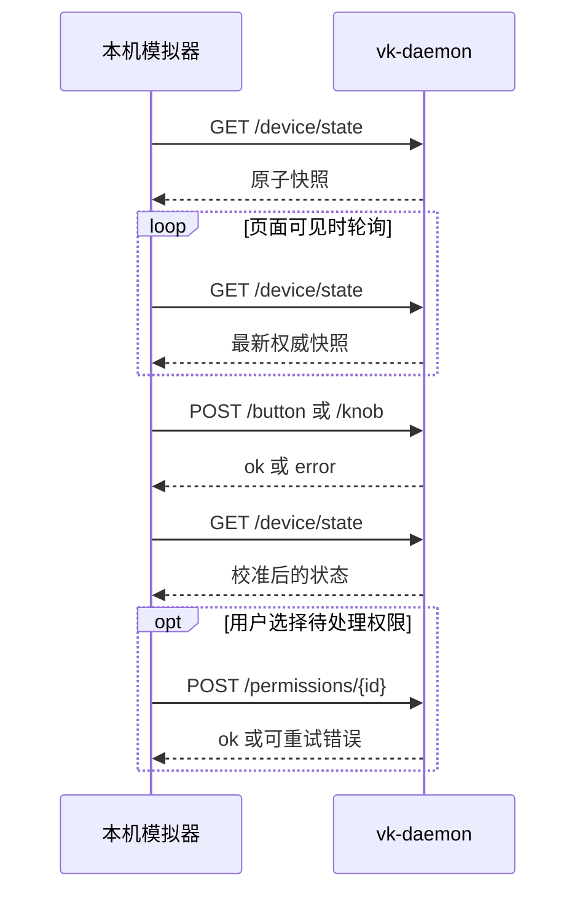

# Vibe Keyboard HTTP API

[English](http_api.md) | [简体中文](http_api.zh-CN.md)

本文定义与 `vk-daemon` 同机运行的外部模拟器可以依赖的稳定 HTTP 契约。

## 连接与编码

```text
Base URL: http://127.0.0.1:19280
Content-Type: application/json; charset=utf-8
```

服务只接受 loopback 连接。它拒绝绑定到非 loopback 地址，也会拒绝 `Origin` 不是 loopback 的
浏览器请求。本 API 没有远程认证边界；不要通过反向代理、端口转发、局域网地址或公网隧道暴露。

基于浏览器的模拟器必须从 `http://localhost`、`http://127.0.0.1` 或 `http://[::1]` origin
提供服务。daemon 会响应 CORS 预检，并在 API 响应中回显已接受的 loopback origin。

下文所有请求体都是 JSON object。成功的变更响应包含 `"ok": true`；错误响应是包含非空
`error` 字符串的 JSON object。

服务支持 HTTP/1.0 和 HTTP/1.1，每个连接只处理一个请求，并始终返回 `Connection: close` 和
`Cache-Control: no-store`。不支持 chunked transfer encoding。Header 上限为 64 KiB，HTTP
body 上限为 5 MiB，JSON 路由最多接受 1 MiB；正常模拟器请求应远小于这些限制。

## 接口摘要

| 方法 | 路径 | 用途 |
| --- | --- | --- |
| `GET` | `/device/state` | 读取一次权威 daemon/device 快照 |
| `GET` | `/sessions` | 读取当前会话集合 |
| `GET` | `/notifications` | 读取未读通知和历史通知 |
| `POST` | `/button` | 发送一个按钮操作 |
| `POST` | `/knob` | 发送一个旋钮操作 |
| `POST` | `/permissions/{id}` | 处理某个会话的待决权限 |

这些路由构成外部模拟器接口。AI 工具 hook 和 daemon 管理路由属于内部集成，可以独立演进。

## 推荐客户端流程



API 不提供 event stream，也不承诺变更版本号或条件请求。应把变更响应视为命令执行结果，再获取
新快照校准显示状态。轮询间隔应与 UI 需求匹配；避免同时运行多个轮询循环，以免响应顺序与请求
发出顺序不同。

## 数据类型

### Session

```json
{
  "id": 17,
  "name": "实现 HTTP 模拟器",
  "status": "permission_needed",
  "has_permission": true,
  "source": "codex",
  "cwd": "/Users/example/project",
  "permission_mode": "default",
  "model": "gpt-5",
  "tokens_in": 3200,
  "tokens_out": 840,
  "cost_usd": 0.12,
  "context_pct": 18,
  "last_message": "运行测试",
  "last_ai_output": "需要批准才能继续。",
  "bundle_id": "com.example.terminal",
  "session_tty": "/dev/ttys004",
  "started_at": 1784700000,
  "last_activity": 1784700060
}
```

`status` 是 `thinking`、`tool_use`、`writing`、`done`、`error`、`idle` 或
`permission_needed`。时间字段是 Unix 秒。`context_pct` 是 0 到 100 的整数。API 字段名为
`has_permission`；客户端不能依赖内部领域名称 `has_permission_request`。

会话 `id` 是 daemon 本地的无符号标识。daemon 重启后可能复用，不能视为全局稳定身份。空字符串
或为零的指标表示相应 AI 工具集成没有提供该元数据。

### Notification

```json
{
  "id": 4,
  "session_id": 17,
  "session_name": "实现 HTTP 模拟器",
  "status": "permission_needed",
  "description": "Bash(uv run pytest)",
  "timestamp": 1784700060,
  "read": false
}
```

`status` 与 Session 使用同一枚举；`timestamp` 是 Unix 秒。

### Pending Permission

```json
{
  "session_id": 17,
  "tool_name": "Bash",
  "tool_input": "uv run pytest"
}
```

`session_id` 同时也是权限决策接口使用的 `{id}`。

### YOLO Configuration

```json
{
  "active": false,
  "allow": ["Read(*)", "Glob(*)", "Grep(*)"],
  "deny": ["Bash(git push*)", "Bash(rm -rf*)", "Bash(sudo*)"],
  "notify_auto_allow": true,
  "auto_allow_log": true
}
```

规则使用区分大小写的 glob 匹配；拒绝规则优先于允许规则。组合后的规则列表编码后最多为 500
字节，以保证完整配置可以通过 BLE 传输。

## GET /device/state

返回一个原子快照。顶层 object 恰好包含以下字段：

```json
{
  "active_session_id": 17,
  "ble_connected": true,
  "sessions": [],
  "notifications": [],
  "pending_permissions": [],
  "held_keys": [],
  "yolo": {
    "active": false,
    "allow": ["Read(*)", "Glob(*)", "Grep(*)"],
    "deny": ["Bash(git push*)", "Bash(rm -rf*)", "Bash(sudo*)"],
    "notify_auto_allow": true,
    "auto_allow_log": true
  }
}
```

响应字段：

| 字段 | 类型 | 含义 |
| --- | --- | --- |
| `active_session_id` | integer 或 `null` | daemon 当前选择的会话 |
| `ble_connected` | boolean | daemon 当前是否连接 BLE peripheral |
| `sessions` | Session array | 与 `GET /sessions` 相同的 DTO |
| `notifications` | Notification array | 与 `GET /notifications` 相同的 DTO |
| `pending_permissions` | Pending Permission array | 尚未解决的权限请求 |
| `held_keys` | string array | daemon 注入且仍保持按下的按键，已排序 |
| `yolo` | YOLO Configuration | 当前有效的自动决策配置 |

初始加载和常规轮询应使用此接口。只需高频刷新一个列表时，可使用对应的集合接口。

快照在创建瞬间是权威的，但 hook 或设备事件可能紧接着改变状态。客户端应使用每次快照替换本地
集合，而不是尝试保留已经从快照中消失的记录。

## GET /sessions

返回 Session object 的 JSON array。没有活动会话时返回空 array。

```http
GET /sessions HTTP/1.1
Host: 127.0.0.1:19280
```

```json
[]
```

## GET /notifications

返回 Notification object 的 JSON array。未读通知按 daemon 优先级排在前面，之后是已读历史。
没有通知时返回空 array。

```http
GET /notifications HTTP/1.1
Host: 127.0.0.1:19280
```

```json
[]
```

## POST /button

发送逻辑按钮操作。

```json
{
  "id": "send",
  "action": "click"
}
```

`id` 必须是 `delete`、`cancel`、`mode`、`session`、`send` 或 `voice`。`action` 必须是
`click`、`down`、`up` 或 `toggle`。发送 `down` 的客户端负责发送配对的 `up`；`held_keys`
会暴露仍处于按下状态的按键。

按钮行为取决于 daemon 状态：

| 按钮 | `click` / `toggle` | `down` / `up` |
| --- | --- | --- |
| `send` | 批准当前待决权限；否则聚焦当前会话并发送 Enter | 不保持按键 |
| `cancel` | 拒绝当前待决权限；否则聚焦当前会话并发送 Escape | 不保持按键 |
| `mode` | 切换并持久化 `yolo.active` | 无操作 |
| `session` | 选择下一个会话 | 无操作 |
| `delete` | 调用一次配置的 Delete 宏 | 按下/释放配置的 Delete 宏 |
| `voice` | 切换一次配置的 Voice 操作 | 启动/停止配置的 Voice 操作 |

无状态控件通常应发送 `click`。为兼容性也接受等价的 `toggle`；它不会建立客户端持有的独立
toggle 状态。

macOS 上默认的 Voice 操作是 `dictation`。每个边沿都会发送原生“双击 Fn”修饰键事件来切换系统
听写：`down` 启动听写，配对的 `up` 停止听写。请在 **系统设置 > 键盘 > 听写 > 快捷键** 中选择
**按下 Fn 键两次**。daemon 会在启动听写前聚焦当前会话，并在 BLE 断开时释放仍保持的 Voice
操作。

成功：

```json
{"ok": true}
```

无效 `id` 或 `action` 返回 `400` 和 `{"error":"..."}`。

## POST /knob

发送旋转编码器操作。

```json
{
  "action": "cw",
  "steps": 1
}
```

`action` 必须是 `cw`、`ccw` 或 `press`。`steps` 必须是 1 到 255 的整数；`press` 应发送
`1`。顺时针和逆时针操作按指定格数移动当前会话选择；按下会激活所选会话。

旋转会在当前会话列表中循环。没有会话时，旋转是成功的空操作；没有当前会话时，按下也是成功的
空操作。

普通成功响应：

```json
{"ok": true}
```

成功的 `press` 还可能包含平台聚焦 `strategy`，客户端应只把它当作诊断信息。无效 `action` 或
`steps` 返回 `400` 和 `{"error":"..."}`。

## POST /permissions/{id}

处理 `session_id` 等于 `{id}` 的待决权限。

```http
POST /permissions/17 HTTP/1.1
Host: 127.0.0.1:19280
Content-Type: application/json

{"action":"allow"}
```

请求体只有 `action` 字段，其值必须是 `allow`、`deny` 或 `always`。

- `allow`：仅批准本次请求。
- `deny`：拒绝本次请求。
- `always`：批准本次请求，并持久化精确的 `tool_name(tool_input)` 模式。

成功：

```json
{"ok": true}
```

无效 id 或 action 返回 `400`。格式正确但没有对应待决权限的 id 返回 `404`。只有在 daemon 提交
决策后，对应 hook 请求才会继续。`always` 无法持久化时，daemon 返回 `503` 并保留待处理权限，
客户端可以重试同一请求。

决策成功后，daemon 还会删除对应的 `permission_needed` 通知，并向设备同步更新后的权威通知列表。

权限决策成功后不具备幂等性：重复相同请求会返回 `404`，因为待处理项已经删除。应将第一个 `200`
视为最终结果。`503` 后重试是安全的，因为待处理请求会被有意保留。

## 状态码

| 状态 | 含义 |
| --- | --- |
| `200` | 请求完成 |
| `204` | Loopback CORS 预检通过；响应没有 body |
| `400` | JSON、路径参数、枚举值或数值范围无效 |
| `403` | 被 loopback origin 策略拒绝 |
| `404` | 路由或待决权限不存在 |
| `413` | HTTP 请求体超过 5 MiB |
| `431` | HTTP header 超过 64 KiB |
| `500` | 未预期的内部错误；客户端应重新获取状态 |
| `503` | 平台操作或必要配置写入失败 |

错误示例：

```json
{"error":"invalid permission action"}
```

客户端可展示 `error` 用于诊断，但分支逻辑应依据 HTTP 状态码，而不是当前英文错误文本。错误文案
不属于兼容性字段。
