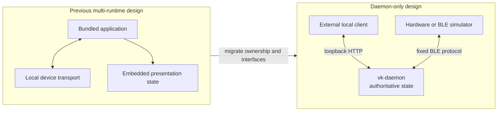
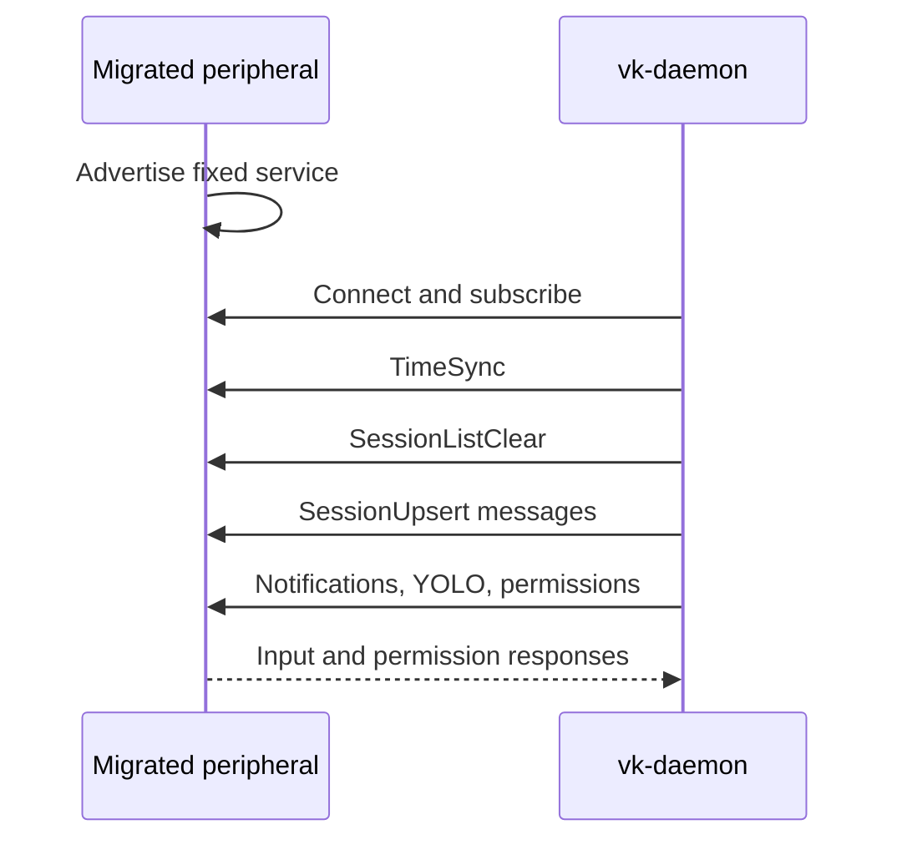

# Daemon-Only Migration

[English](migration.md) | [简体中文](migration.zh-CN.md)

Vibe Keyboard has been narrowed to one `vk-daemon` runtime. Integrations now cross one of two
public boundaries: loopback HTTP for clients on the daemon host, or Bluetooth LE for trusted
peripherals.

## Architecture Change



This is an ownership change, not only a packaging change. Clients render daemon snapshots and
submit intent; they no longer share or own runtime state.

## Preserved

- Claude Code and Codex hooks, transcript discovery, and session lifecycle management.
- Pending-permission handling, YOLO rules, notifications, focus, keystrokes, macros, and sound.
- The dependency-free `asyncio` HTTP server, now restricted to loopback.
- Binary BLE uplink/downlink variants, tag values, field order, and little-endian encoding.
- The daemon CLI and TOML configuration file.

## Removed From the Runtime

- Bundled interactive clients and launchers.
- Local process-to-process device transport.
- Rendered device presentation and framebuffer ownership.
- Application packaging that owned or launched the daemon.

These features are intentionally outside this package. A new client belongs in another project
and must use a documented boundary.

## Integration Mapping

| Previous integration | Replacement | Migration note |
| --- | --- | --- |
| In-process/local device peer | `GET /device/state` plus input endpoints | Replace shared objects with JSON DTOs |
| Shared local transport | Loopback HTTP | Run the client on the daemon host |
| Embedded presentation state | Client-owned rendering of daemon snapshots | Replace collections on reconciliation |
| Indirect permission approval | `POST /permissions/{session_id}` | Use `allow`, `deny`, or `always` explicitly |
| Firmware-like test peer | BLE peripheral with fixed UUIDs | Peripheral advertises; daemon scans |
| Stream-framed BLE payload | One message per characteristic value | Remove length/direction wrappers |
| Client-launched daemon | Independently managed `vk-daemon serve` | Add process supervision outside this package |

## Local Client Migration

1. Start `vk-daemon` independently and verify `GET /health` locally.
2. Remove imports of daemon internals and any process-local transport setup.
3. Load initial state from `GET /device/state` and treat every response as authoritative.
4. Replace input calls with `POST /button` and `POST /knob`.
5. Render `pending_permissions` and respond through `POST /permissions/{id}`.
6. Poll and reconcile state after commands; do not assume a successful command contains new state.
7. Serve browser clients from a loopback HTTP origin so the daemon accepts their CORS requests.
8. Exercise empty lists, daemon restart, permission timeout, and `400`/`404`/`503` paths.

The stable surface is:

```text
GET  /device/state
GET  /sessions
GET  /notifications
POST /button
POST /knob
POST /permissions/{id}
```

Do not use internal hook, setup, sound, focus, configuration, health, or diagnostic routes as a
simulator contract. Do not bind HTTP to a LAN address. See the [HTTP API](http_api.md) for DTOs and
behavior.

## BLE Peripheral Migration

1. Make the hardware or simulator a peripheral that advertises the fixed service UUID and,
   preferably, `VibeKeyboard` name.
2. Expose the command characteristic for write-with-response and the event characteristic for
   notifications.
3. Remove any stream length/direction wrapper. One characteristic value is one
   `[tag:u8][fields...]` message.
4. Configure the command value and long-write path for complete logical writes up to 500 bytes.
5. Implement `SessionListClear`, `SessionUpsert`, and `SessionRemove`; keep legacy
   `SessionListUpdate` decoding only for compatibility.
6. On `SessionListClear`, discard stale local sessions and rebuild from following upserts.
7. Handle disconnect by continuing to advertise; expect a full authoritative sync after reconnect.
8. Verify every enum, field width, UTF-8 byte length, and little-endian integer against the
   [BLE protocol](ble_protocol.md).



## Configuration Migration

The default path is `~/.config/vk-daemon/config.toml`. Review the effective configuration rather
than copying obsolete application settings blindly:

```bash
uv run vk-daemon config show
uv run vk-daemon setup status
```

Reinstall Claude Code and Codex hooks so they target the selected daemon port. CLI `serve --port`
overrides the process listener for that invocation; setup must use the same port through `--port`
or `general.hook_port`.

## Cutover Checklist

- The daemon starts under the intended supervisor and only binds loopback.
- `GET /device/state` works before the old client/runtime is stopped.
- Claude Code and Codex setup status reports the expected hook state.
- The client tolerates empty state and a daemon restart.
- Allow, deny, always, and 300-second timeout paths fail closed as expected.
- Delete/Voice press and release pairs do not leave entries in `held_keys`.
- BLE reconnect performs `SessionListClear` followed by current session upserts.
- The peripheral accepts a 500-byte logical command write.
- No external component imports `vibe_keyboard.daemon` internals.
- No legacy process-local transport or daemon launcher remains active.

## Rollback

Keep the old runtime stopped but available until the new daemon and clients pass the checklist.
To roll back, stop `vk-daemon`, restore the old process supervisor and hook configuration, and
ensure only one runtime receives AI-tool events. Do not run old and new state owners concurrently;
duplicate hooks can create conflicting permission responses and duplicated notifications.

The new config command keeps a backup when `config reset` replaces an existing file. Preserve any
separate legacy configuration independently because its schema is not part of this migration
contract.

## Verification

Run from the project root:

```bash
uv sync --extra dev --extra ble
uv run pytest
uv run ruff check .
uv run mypy src
python -m compileall src tests
uv run vk-daemon serve
```
