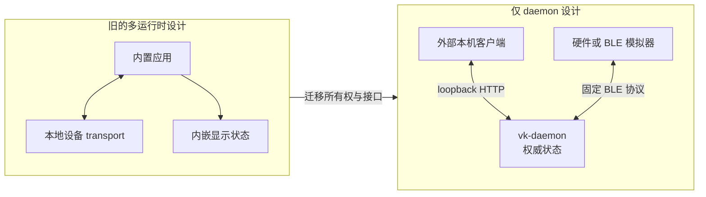
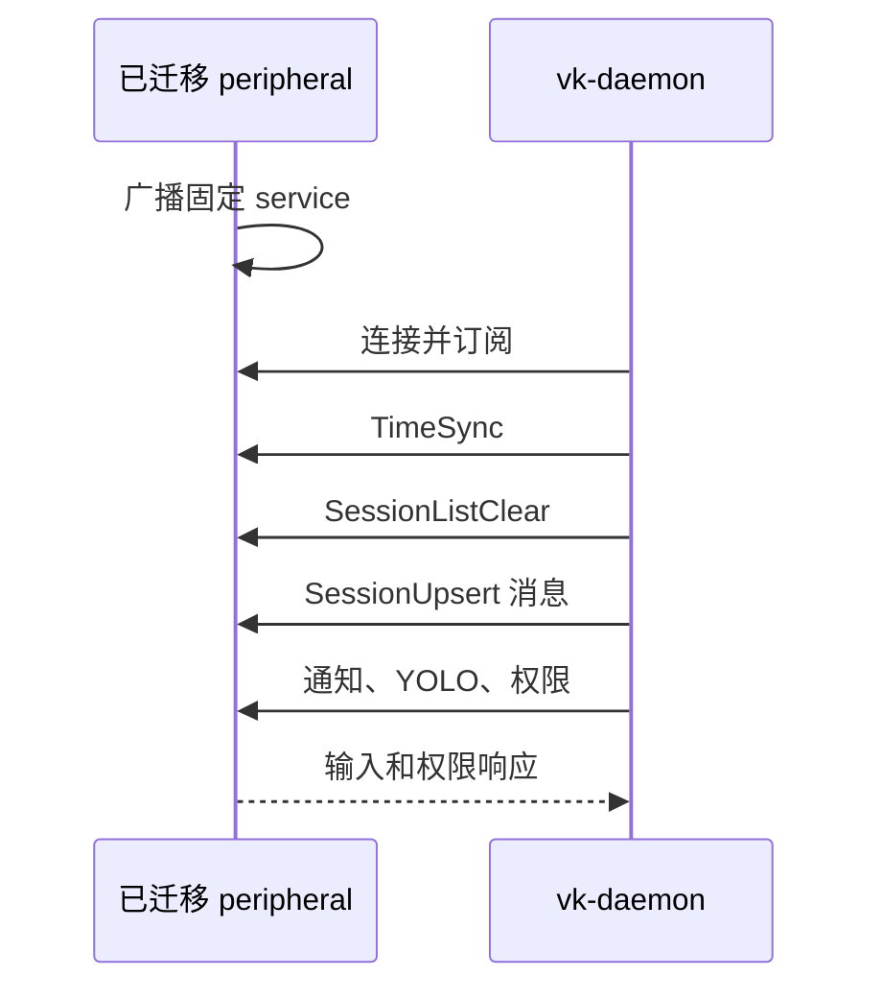

# 仅 Daemon 架构迁移指南

[English](migration.md) | [简体中文](migration.zh-CN.md)

Vibe Keyboard 已收敛为单一 `vk-daemon` 运行时。所有集成现在只跨越两个公共边界之一：同机客户端
使用 loopback HTTP，可信 peripheral 使用 Bluetooth LE。

## 架构变化



这不仅是打包方式变化，也是状态所有权变化。客户端负责呈现 daemon 快照并提交操作意图，不再共享
或拥有运行时状态。

## 保留内容

- Claude Code/Codex hook、transcript 发现和会话生命周期管理。
- 待决权限、YOLO 规则、通知、聚焦、按键、宏和声音。
- 无第三方依赖的 `asyncio` HTTP 服务，现限制为 loopback。
- BLE 上行/下行 variant、tag 值、字段顺序和小端序编码。
- daemon CLI 和 TOML 配置文件。

## 从运行时移除的内容

- 内置交互式客户端和 launcher。
- 进程到进程的本地设备 transport。
- 设备显示和 framebuffer 状态所有权。
- 负责持有或启动 daemon 的应用打包层。

这些能力被有意移出本包。新客户端必须位于独立项目，并使用已文档化的边界。

## 集成映射

| 旧集成 | 替代方式 | 迁移说明 |
| --- | --- | --- |
| 进程内/本地设备 peer | `GET /device/state` 加输入接口 | 用 JSON DTO 替换共享对象 |
| 共享本地 transport | Loopback HTTP | 客户端与 daemon 同机运行 |
| 内嵌显示状态 | 客户端呈现 daemon 快照 | 校准时替换本地集合 |
| 间接权限批准 | `POST /permissions/{session_id}` | 显式发送 `allow`、`deny` 或 `always` |
| 固件式测试 peer | 使用固定 UUID 的 BLE peripheral | peripheral 广播，daemon 扫描 |
| 带 stream frame 的 BLE payload | 每个 characteristic value 一条消息 | 删除长度/方向 wrapper |
| 客户端启动 daemon | 独立管理 `vk-daemon serve` | 在包外配置进程监管 |

## 本机客户端迁移

1. 独立启动 `vk-daemon`，在本机验证 `GET /health`。
2. 删除对 daemon 内部模块的 import 和所有进程内 transport 初始化。
3. 从 `GET /device/state` 加载初始状态，并把每次响应视为权威快照。
4. 用 `POST /button` 和 `POST /knob` 替换输入调用。
5. 显示 `pending_permissions`，通过 `POST /permissions/{id}` 响应。
6. 命令后轮询并校准；不能假设命令成功响应中包含新状态。
7. 浏览器客户端从 loopback HTTP origin 提供服务，以通过 CORS 检查。
8. 覆盖空列表、daemon 重启、权限超时和 `400`/`404`/`503` 路径。

稳定接口为：

```text
GET  /device/state
GET  /sessions
GET  /notifications
POST /button
POST /knob
POST /permissions/{id}
```

不得把内部 hook、setup、声音、聚焦、配置、健康检查或诊断路由当作模拟器契约。不要把 HTTP 绑定
到局域网地址。DTO 和行为见 [HTTP API 中文文档](http_api.zh-CN.md)。

## BLE Peripheral 迁移

1. 将硬件或模拟器实现为 peripheral，广播固定 service UUID，建议同时广播 `VibeKeyboard` 名称。
2. command characteristic 支持 write-with-response；event characteristic 支持 notification。
3. 删除 stream 长度/方向 wrapper；一个 characteristic value 就是一条 `[tag:u8][fields...]` 消息。
4. 配置 command value 与 long-write 路径，支持最多 500 字节的完整逻辑写入。
5. 实现 `SessionListClear`、`SessionUpsert`、`SessionRemove`；旧 `SessionListUpdate` 只为兼容解码。
6. 收到 `SessionListClear` 后丢弃旧会话，并用后续 upsert 重建。
7. 断连后继续广播；重连后应接收完整权威同步。
8. 按 [BLE 协议中文文档](ble_protocol.zh-CN.md) 验证所有枚举、字段宽度、UTF-8 字节长度和小端序。



## 配置迁移

默认路径为 `~/.config/vk-daemon/config.toml`。应检查有效配置，不要盲目复制过期的应用设置：

```bash
uv run vk-daemon config show
uv run vk-daemon setup status
```

重新安装 Claude Code 和 Codex hook，使其指向所选 daemon 端口。CLI `serve --port` 只覆盖当前
进程的监听端口；setup 必须通过 `--port` 或 `general.hook_port` 使用同一端口。

## 切换检查表

- daemon 由预期 supervisor 启动，并且只绑定 loopback。
- 停止旧客户端/运行时前，`GET /device/state` 已可用。
- Claude Code 和 Codex setup 状态符合预期。
- 客户端能处理空状态和 daemon 重启。
- allow、deny、always 和 300 秒超时路径都按预期 fail-closed。
- Delete/Voice 的 press/release 配对不会在 `held_keys` 中留下残留项。
- BLE 重连会先收到 `SessionListClear`，再收到当前会话 upsert。
- peripheral 能接受 500 字节的逻辑 command write。
- 外部组件不再 import `vibe_keyboard.daemon` 内部模块。
- 旧的进程内 transport 和 daemon launcher 均已停止。

## 回退

在新 daemon 和客户端通过检查表前，保留但停止旧运行时。回退时停止 `vk-daemon`，恢复旧的进程
监管与 hook 配置，并确保只有一个运行时接收 AI 工具事件。不要同时运行新旧状态所有者；重复 hook
会造成冲突的权限响应和重复通知。

`config reset` 替换已有文件时会保留备份。旧配置应另行保存，因为其 schema 不属于本迁移契约。

## 验证

在项目根目录执行：

```bash
uv sync --extra dev --extra ble
uv run pytest
uv run ruff check .
uv run mypy src
python -m compileall src tests
uv run vk-daemon serve
```
