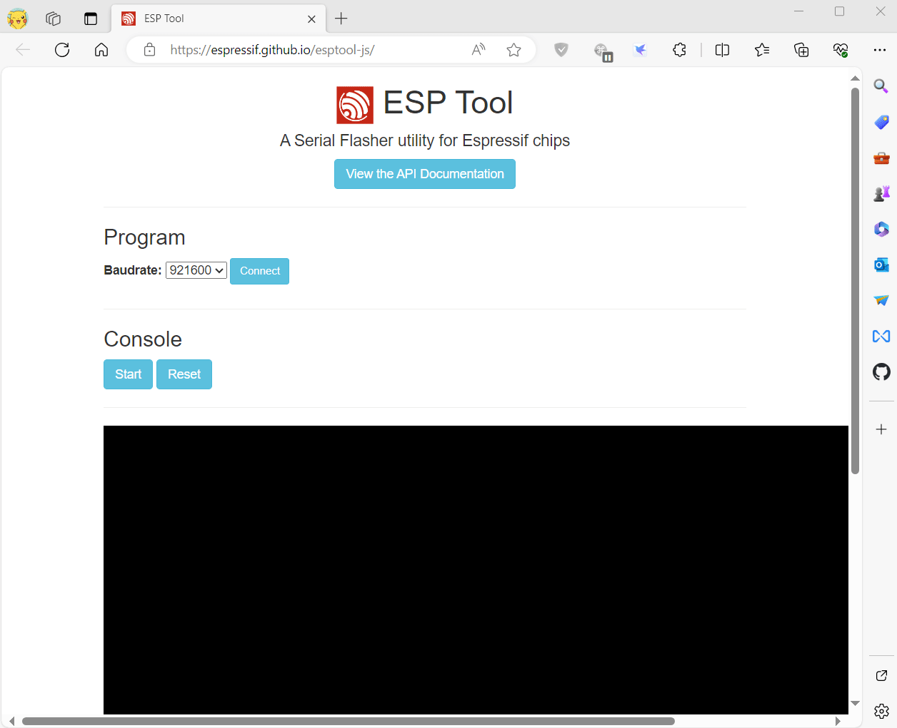

<div align="center" markdown="1">
  
</div>

<h1 align = "center">🌟LilyGo Firmware🌟</h1>


> \[!IMPORTANT]
>
> - How do I prove to LilyGo that the board is broken?
> 1. You need to shoot a video to prove that the board is broken. Please follow the steps below to shoot a video to prove that the board is broken.
> 2. Follow the steps at the bottom of this page to put the board into download mode.
> 3. Select the burning tool, download the corresponding firmware, and upload the firmware to the board through the burning tool.
> 4. After the burning is complete, press the RST key, or disconnect the USB connection and reinsert it. If the board has a battery, you must power it off and restart to exit download mode.
> 5. Plug in the USB, open the serial port, and record the contents of the serial monitor.
> 6. Any of the above steps must be included in the video content to facilitate explanation.
>

## 1️⃣Support Product

| Product                            | Firmware                                              |
| ---------------------------------- | ----------------------------------------------------- |
| [T-LoRa-Pager][1]                  | [firmware](./factory.tlora.pager.sx1262.20250512.bin) |
| [T-Watch-Ultra][2]                 | [firmware](./factory.watch.ultra.sx1262.20250512.bin) |
| [T-Watch-S3 or T-Watch-S3-Plus][3] | [firmware](./factory.twatchs3.sx1262.20250516.bin)    |

[1]: https://www.lilygo.cc/products
[2]: https://www.lilygo.cc/products
[3]: https://www.lilygo.cc/products

## 2️⃣How to Flash ?

> \[!IMPORTANT]
>
> 🤖 USB ports keep popping in and out?
>
> * T-Watch-S3 see [here](../docs/lilygo-t-watch-s3.md#t-watch-s3-enter-download-mode)
> * T-Watch-S3-Plus see  [here](../docs/lilygo-t-watch-s3-plus.md#t-watch-s3-plus-enter-download-mode)
> * T-Watch-Ultra see [here](../docs/lilygo-t-watch-ultra.md#t-watch-s3-ultra-enter-download-mode)
> * T-LoRa-Pager see [here](../docs/lilygo-t-lora-pager.md#t-lora-pager-enter-download-mode)
>

### Use ESP Download Tool

- Download [Flash_download_tool](https://dl.espressif.com/public/flash_download_tool.zip)


* Note that after writing is completed, you need to press RST to reset.
* T-Watch-S3 does not have a reset button, you must power off and restart to start, otherwise it will always be in download mode

### Use Web Flasher

- [ESP Web Flasher Online](https://espressif.github.io/esptool-js/)



* Note that after writing is completed, you need to press RST to reset.
* T-Watch-S3 does not have a reset button, you must power off and restart to start, otherwise it will always be in download mode

### Use command line


If system asks about install Developer Tools, do it.

```bash
python3 -m pip install --upgrade pip
python3 -m pip install esptool
```

In order to launch esptool.py, exec directly with this:

```bash
python3 -m esptool
```

For ESP32-S3 use the following command to write

```bash
esptool --chip esp32s3  --baud 921600 --before default_reset --after hard_reset write_flash -z --flash_mode dio --flash_freq 80m 0x0 firmware.bin

```
